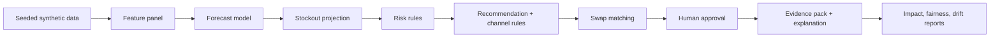
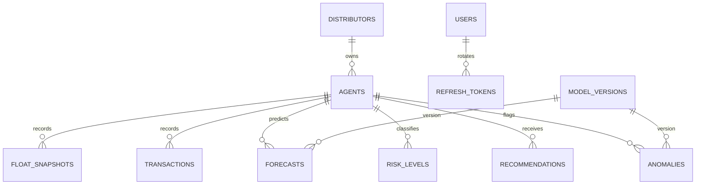

# AgentPulse: কোড-স্তরের পরিচিতি

## ০. সংক্ষিপ্ত পরিচিতি

AgentPulse একটি role-ভিত্তিক web app; frontend route `/agent`, `/distributor`, `/admin` (frontend/src/app/router.tsx:124-126)।
এজেন্ট, ডিস্ট্রিবিউটর ও অ্যাডমিন আলাদা কাজের ক্ষেত্র ব্যবহার করেন (frontend/src/app/routes.ts:10-39)।
এটি এজেন্টের cash/e-money float-এর forecast, ঝুঁকি এবং পুনঃসরবরাহ-সিদ্ধান্তে সহায়তা করে (frontend/src/app/routes.ts:11-29)।
এজেন্ট runway ও পরবর্তী পদক্ষেপ দেখে; ডিস্ট্রিবিউটর queue ও agent portfolio পর্যালোচনা করেন (frontend/src/app/routes.ts:11-29)।
১) seeded synthetic history ও event data ডেটাবেসে থাকে (backend/app/core/config.py:11, backend/app/services/seed.py:1-15)।
২) forecast model horizon-ভিত্তিক float-এর পূর্বাভাস তৈরি করে (backend/ml/training/train.py:1-12)।
৩) stockout/risk নিয়ম forecast থেকে ঝুঁকি শ্রেণি বের করে (backend/app/services/risk.py:1-16)।
৪) recommendation/channel/swap প্রস্তাবগুলো ব্যবহারকারীদের সামনে আসে (frontend/src/app/routes.ts:14,26)।
৫) অনুমোদিত মানুষ request/swap সিদ্ধান্ত দেন; সিদ্ধান্তে note ও audit থাকে (backend/app/api/v1/swaps.py:52-58, backend/app/api/v1/recommendation_requests.py:67)।
ML সংখ্যাগত পূর্বাভাস দেয়; rules ঝুঁকি ও প্রস্তাবের সীমা প্রয়োগ করে (backend/app/rules/risk_rules.py:1-8, backend/app/rules/rebalance_rules.py:1-8)।
LLM ব্যাখ্যামূলক ভাষা/চ্যাট তৈরি করতে পারে; UI-তে forecast model আর AI wording আলাদা রাখা হয় (frontend/src/app/routes.ts:16, backend/app/api/v1/llm.py:31-40)।
সিস্টেমের মানব-অনুমোদনযোগ্য সিদ্ধান্ত মানুষই নেন (backend/app/api/v1/swaps.py:52-58)।
এটি ব্রাউজারে চালিত web app; native mobile app: §৬ item 1 দেখুন।

## ১. বড় ছবি

চিত্রে `forecast`, `risk`, `rebalance`, `swap` এবং `impact/fairness` এর ধাপগুলো নিজ নিজ service/rule-এ চলে (backend/app/services/pipeline.py:20-33; backend/app/services/forecast.py:56-89; backend/app/services/risk.py:58-97; backend/app/services/rebalance.py:195-218; backend/app/services/backtest.py:24-41)।

| স্তর | কোডের ফোল্ডার | কাজ ও নিষেধের সীমা |
|---|---|---|
| ML | `backend/ml/features`, `backend/ml/training`, `backend/ml/inference` | `LightGBM` quantile forecast ও `Isolation Forest` anomaly score দেয়; anomaly flag নিজে fraud verdict নয় (backend/ml/training/train.py:70-85; backend/ml/inference/anomaly.py:1-4)। |
| Rules | `backend/app/rules` এবং orchestration `backend/app/services` | probability-কে risk level, need-কে amount/channel, এবং donor-কে feasible swap-এ রূপ দেয়; নিয়মের বাইরে স্বয়ংক্রিয় আর্থিক কাজ করার কোড পাওয়া যায়নি (backend/app/rules/risk_rules.py:49-60; backend/app/rules/rebalance_rules.py:66-78; backend/app/services/recommendation_requests.py:1-5)। |
| LLM | `backend/app/llm`, `backend/app/api/v1/llm.py` | evidence pack থেকে ভাষায় ব্যাখ্যা/উত্তর; numeric সিদ্ধান্তের উৎস নয় (backend/app/llm/packs.py:60-120; backend/app/llm/service.py:166-203)। LLM-এর মাধ্যমে অর্থ স্থানান্তর অনুমোদিত নয়; code-এ provider action claim guard আছে (backend/app/llm/guard.py:108-115)। |

### রাউটিং ও API map

Frontend-এর সম্পূর্ণ ভূমিকা-ভিত্তিক route catalogue `frontend/src/app/routes.ts:10-39`; বাস্তব lazy component ও role guard `frontend/src/app/router.tsx:29-132`-এ। E2E route inventory `e2e/routes.ts:15-75`-এ আছে; listed route-গুলি smoke visit-এর তালিকা, সব route-এর API contract নয়।

Backend prefix `/api/v1`; router registration-এ `risk` router `agents`-এর আগে রাখা হয়েছে (backend/app/api/v1/__init__.py:28-49)। নিচের endpoint-গুলো page mapping-এর প্রধান API; প্রতিটি concrete backend route/dependency-এর function reference পরের টেবিলগুলোতে রয়েছে।

## ২. ব্যবহারকারীর কাজের প্রবাহ

### Agent

- নিজের account-এর linked agent record-এর forecast দেখেন (backend/app/models/org.py:79-85; frontend/src/features/agent/home/AgentHomePage.tsx:1-25)।
- cash/e-money balance projection ও stockout horizon তুলনা করেন (frontend/src/app/routes.ts:11-13)।
- need থাকলে top-up/rebalance recommendation পর্যালোচনা করেন (frontend/src/app/routes.ts:14-15)।
- recommendation request পাঠাতে ও swap response দিতে পারেন (frontend/src/api/services/agents.ts:53-61; frontend/src/api/services/swaps.ts:13-18)।
- AI-লিখিত ব্যাখ্যা/চ্যাট পড়েন; এটি সিদ্ধান্তের উৎস হিসেবে নয় (frontend/src/app/routes.ts:16-18; backend/app/llm/service.py:166-203)।

| Route | Page component | দেখা/কাজ | API (method path) | Handler → core | DB পড়া/লেখা | Features | Permission |
|---|---|---|---|---|---|---|---|
| `/agent` | `AgentHomePage` (`frontend/src/app/router.tsx:35,62`) | নিজের float, risk, next action (`frontend/src/app/routes.ts:11`) | `GET /agents/{id}/summary`, `GET /agents/{id}/recommendation` (`frontend/src/api/services/agents.ts:18-35`) | `get_summary` → `risk_read.summary`; `get_recommendation` → `recommendation_read.get` (`backend/app/api/v1/risk.py:60-66`, `backend/app/api/v1/recommendations.py:10-12`) | `agents`, `risk_levels`, `stockout_predictions`, `recommendations` (`backend/app/models/org.py:39-63`, `backend/app/models/predictions.py:101-122`, `backend/app/models/actions.py:20-46`) | F1-F4, F7 | `ScopedAgent`: linked agent ownership; role guard `agent` (`backend/app/api/v1/risk.py:60`, `backend/app/core/deps.py:1-69`; route guard `frontend/src/app/router.tsx:124`) |
| `/agent/forecast` | `ForecastPage` (`frontend/src/app/router.tsx:36,64`) | runway ও forecast horizon (`frontend/src/app/routes.ts:12`) | `GET /agents/{id}/forecast`, `POST /agents/{id}/whatif` (`frontend/src/api/services/agents.ts:22-24,42-44`) | `get_forecast` → `forecast.agent_forecast`; `post_whatif` → `whatif.run` (`backend/app/api/v1/forecast.py:13-18`, `backend/app/api/v1/whatif.py:18-27`) | `forecasts`, `agents`; what-if cache/query থেকে read (`backend/app/models/predictions.py:43-63`, `backend/ml/inference/whatif.py:25-26`) | F1,F2,F6,F8 | `ScopedAgent` plus caller role/scope (`backend/app/api/v1/forecast.py:14-18`, `backend/app/api/v1/whatif.py:15-20`) |
| `/agent/stockout` | `StockoutPage` (`frontend/src/app/router.tsx:37,65`) | কখন float ফুরোতে পারে ও probability (`frontend/src/app/routes.ts:13`) | `GET /agents/{id}/stockout`, `GET /agents/{id}/risk` (`frontend/src/api/services/agents.ts:26-32`) | `get_stockout` / `get_risk` → `risk_read.stockout`, `risk_read.risk` (`backend/app/api/v1/risk.py:69`) | `stockout_predictions`, `risk_levels` (`backend/app/models/predictions.py:82-122`) | F2,F3 | `ScopedAgent` (`backend/app/api/v1/risk.py:69`) |
| `/agent/rebalance`, `/agent/swap` | `RebalancePage` (`frontend/src/app/router.tsx:38,69`) | Recommendation, request history, swap offer (`frontend/src/app/routes.ts:14,17`) | `GET /agents/{id}/recommendation`, `POST /recommendations/{id}/request`, `GET /recommendation-requests`, `GET /swaps`, `POST /swaps/{id}/respond` (`frontend/src/api/services/agents.ts:34-61`, `frontend/src/api/services/swaps.ts:8-18`) | `get_recommendation` → `recommendation_read.get`; `create_request` → `recommendation_requests.create`; `respond` → `swaps.respond` (`backend/app/api/v1/recommendations.py:10-12`, `backend/app/api/v1/recommendation_requests.py:39-52`, `backend/app/api/v1/swaps.py:57-58`) | `recommendations`, `recommendation_requests`, `swap_suggestions`, `swap_responses`, `audit_log` (`backend/app/models/actions.py:20-107`) | F4,F5 | Agent role; agent request is own recommendation; response party is donor/receiver (`backend/app/api/v1/recommendation_requests.py:39-45`, `backend/app/services/swaps.py:91-113`) |
| `/agent/what-if` | `WhatIfPage` (`frontend/src/app/router.tsx:39,68`) | balance delta scenario slider (`frontend/src/app/routes.ts:15`) | `POST /agents/{id}/whatif` (`frontend/src/api/services/agents.ts:42-44`) | `post_whatif` → `whatif.run` → `ml.inference.whatif.run` (`backend/app/api/v1/whatif.py:18-27`, `backend/app/services/whatif.py:51-65`) | `forecasts`, `agents` read only (`backend/app/services/whatif.py:51-65`) | F8 | agent or distributor, plus `ScopedAgent` (`backend/app/api/v1/whatif.py:15-20`) |
| `/agent/explain`, `/agent/copilot` | `ExplainPage`, `CopilotPage` (`frontend/src/app/router.tsx:40-41,67-68`) | reason breakdown and grounded Bangla/English assistant (`frontend/src/app/routes.ts:16,18`) | `GET /agents/{id}/explanations`, `POST /explanations/narrate`, `POST /copilot/chat` (`frontend/src/api/services/agents.ts:30-51`, `frontend/src/api/services/copilot.ts:1-40`) | `get_explanations` → `explanation.agent_explanation`; `narrate` → `_run`; `copilot_chat` → `_stream` (`backend/app/api/v1/explanations.py:13-20`, `backend/app/llm/service.py:166-203`, `backend/app/api/v1/copilot.py:53-79`) | `forecast_explanations`, `llm_cache`, `llm_call_log`, `copilot_messages` (`backend/app/models/predictions.py:64-80`, `backend/app/models/llm.py:14-63`) | F7, LLM | own `ScopedAgent`; copilot requires current user and resolves linked agent (`backend/app/api/v1/explanations.py:14-20`, `backend/app/api/v1/copilot.py:30-44`) |

### Distributor

- নিজের scope-এর agent portfolio ও risk map দেখেন (`backend/app/core/deps.py:1-69`)।
- agent detail-এ forecast, risk, recommendation ও activity দেখেন (`frontend/src/app/routes.ts:23-29`)।
- swap, recommendation request ও anomaly review পরিচালনা করেন (`backend/app/api/v1/swaps.py:52-58`, `backend/app/api/v1/recommendation_requests.py:67`, `backend/app/api/v1/anomalies.py:47-48`)।
- impact comparison এবং evidence-ভিত্তিক briefing দেখেন (`frontend/src/app/routes.ts:29-30`)।
- অনুমোদন বা review-এ নোট দেন; backend user ও action audit করে (backend/app/services/swaps.py:102-113; backend/app/services/recommendation_requests.py:61-67)।

| Route | Page component | দেখা/কাজ | API (method path) | Handler → core | DB পড়া/লেখা | Features | Permission |
|---|---|---|---|---|---|---|---|
| `/distributor` | `ControlRoomPage` (`frontend/src/app/router.tsx:43,72`) | risk map ও swap (`frontend/src/app/routes.ts:23`) | `GET /map/agents`, `GET /swaps` (`frontend/src/api/services/map.ts:1-30`, `swaps.ts:8-10`) | `get_map_agents` → `risk_map.map_agents`; `list_swaps` → `swaps.page` (`backend/app/api/v1/risk_map.py:18-23`, `backend/app/api/v1/swaps.py:25-37`) | `agents`, `risk_levels`, `stockout_predictions`, `swap_suggestions` (`backend/app/models/predictions.py:82-141`) | F3,F10,F5 | distributor/admin role; distributor data restricted by `distributor_id` (`backend/app/api/v1/risk_map.py:12-22`, `backend/app/services/risk_map.py:1-45`) |
| `/distributor/agents`, `/distributor/agents/:id` | `AgentsPage`, `AgentDetailPage` (`frontend/src/app/router.tsx:44-45,74-75`) | table/filter/export; selected agent tabs (`frontend/src/app/routes.ts:24-25`) | `GET /agents/risk`, `GET /agents/{id}/summary`, `GET /agents/{id}/forecast`, `GET /agents/{id}/recommendation`, `GET /agents/{id}/explanations`, `GET /agents/risk/export.csv` (`frontend/src/api/services/agents.ts:18-35,64-69`) | `list_risk`, `get_summary`, `get_forecast`, `get_recommendation`, `get_explanations` → `risk_read`, `forecast`, `recommendation_read`, `explanation` (`backend/app/api/v1/risk.py:21-69`) | `agents`, `forecasts`, `risk_levels`, `recommendations`, `forecast_explanations` (`backend/app/models/org.py:39-63`, `backend/app/models/predictions.py:43-122`, `backend/app/models/actions.py:20-46`) | F1-F4,F7 | `CurrentUser` plus scoped list; detail `ScopedAgent` (`backend/app/api/v1/risk.py:21-69`) |
| `/distributor/swaps` | `SwapsPage` (`frontend/src/app/router.tsx:46,76`) | approve/reject ও CSV (`frontend/src/app/routes.ts:26`) | `GET /swaps`, `POST /swaps/{id}/decision`, `GET /swaps/export.csv` (`frontend/src/api/services/swaps.ts:8-24`) | `list_swaps`, `decide` → `swaps.page`, `swaps.decide` (`backend/app/api/v1/swaps.py:25-58`) | `swap_suggestions`, `agents`, `audit_log` (`backend/app/services/swaps.py:33-46,102-140`) | F5 | distributor only, scope query; decision note required (`backend/app/api/v1/swaps.py:16,52-62`, `backend/app/services/swaps.py:112-113`) |
| `/distributor/anomalies`, `/:id` | `AnomaliesPage` (`frontend/src/app/router.tsx:47,77-78`) | Isolation Forest flags, evidence, narrative, review (`frontend/src/app/routes.ts:27-28`) | `GET /anomalies`, `GET /anomalies/{id}`, `GET /anomalies/{id}/narrative`, `POST /anomalies/{id}/review` (`frontend/src/api/services/anomalies.ts:4-16`, `briefing.ts:10-12`) | `list_anomalies`, `get_anomaly`, `review_anomaly` → `anomalies.page/detail/review` (`backend/app/api/v1/anomalies.py:29-48`) | `anomalies`, `agents`, `audit_log`, LLM logs (`backend/app/models/predictions.py:124-141`, `backend/app/services/anomalies.py:1-90`) | F9, LLM | distributor/admin reviewer, own agent scope (`backend/app/api/v1/anomalies.py:15,42-60`) |
| `/distributor/impact`, `/distributor/briefing` | `ImpactPage`, `BriefingPage` (`frontend/src/app/router.tsx:48-49,79-80`) | model-vs-baseline metrics; natural language evidence summary (`frontend/src/app/routes.ts:29-30`) | `GET /impact/summary`, `GET /impact/comparison`, `GET /distributor/briefing` (frontend/src/features/distributor/impact/ImpactPage.tsx:55-56; `frontend/src/api/services/briefing.ts:4-8`) | `get_summary/get_comparison` → `impact_read`; `distributor_briefing` → `_run` (`backend/app/api/v1/impact.py:23-36`, `backend/app/api/v1/llm.py:51-84`) | `impact_results`, `system_meta`, `llm_call_log`, `llm_cache` (`backend/app/models/predictions.py:149-169`, `backend/app/models/system_meta.py:11-14`) | F11, LLM | distributor/admin; own distributor scope (`backend/app/api/v1/impact.py:14-36`, `backend/app/api/v1/llm.py:23-25`) |

### Admin

- system readiness, active models ও open queues দেখেন (`frontend/src/app/routes.ts:32`)।
- synthetic data, events, users ও model jobs পরিচালনা করেন (`frontend/src/app/routes.ts:33-38`)।
- audit entries, LLM usage ও drift পর্যবেক্ষণ করেন (`backend/app/api/v1/admin.py:92-93`, `backend/app/api/v1/admin_ops.py:46-92`)।
- retraining/generation job শুরু করে status দেখেন (`backend/app/api/v1/admin_ops.py:60-90`)।
- fairness/model card-এ সীমাবদ্ধতা পড়েন; admin review ক্ষমতা endpoint-ভিত্তিক (`frontend/src/features/responsibleAi/ResponsibleAiPage.tsx:40-78`)।

| Route | Page component | দেখা/কাজ | API (method path) | Handler → core | DB পড়া/লেখা | Features | Permission |
|---|---|---|---|---|---|---|---|
| `/admin` | `AdminOverviewPage` (`frontend/src/app/router.tsx:50,83`) | readiness, model ও queue overview (`frontend/src/app/routes.ts:32`) | `GET /admin/overview` (`frontend/src/api/services/admin.ts:18-20`) | `get_overview` → `admin_overview.overview` (`backend/app/api/v1/admin.py:42-48`) | `users`, `agents`, `model_versions`, queue tables, `audit_log` (`backend/app/services/admin_overview.py:33-57`) | ops | admin only (`backend/app/api/v1/admin.py:31,42-48`) |
| `/admin/events`, `/admin/data` | `AdminEventsPage`, `AdminDataPage` (`frontend/src/app/router.tsx:51-52,84-85`) | event CRUD, dataset summary/assumptions (`frontend/src/app/routes.ts:33-34`) | `/events` CRUD, `GET /admin/data`, `GET /admin/data/assumptions` (`frontend/src/api/services/events.ts:1-40`, `admin.ts:44-51`) | `list_events/create_event/update_event/delete_event`; `get_data/get_assumptions` (`backend/app/api/v1/events.py:25-56`, `backend/app/schemas/admin_ops.py:31-42`) | `events`, `audit_log`, `system_meta` (`backend/app/models/timeseries.py:58-66`, `backend/app/services/events.py:60-77`) | F6, ops | event writes admin; event reads authenticated user (`backend/app/api/v1/events.py:16,25-63`) |
| `/admin/models` | `AdminModelsPage` (`frontend/src/app/router.tsx:53,86`) | registry, holdout metrics, job actions, drift (`frontend/src/app/routes.ts:35`) | `GET /admin/models`, `/admin/drift`, `/admin/jobs`; `POST /admin/jobs` (`frontend/src/api/services/admin.ts:60-87`) | `get_models/get_drift/list_jobs/start_job` → `model_registry`, `drift.report`, `jobs.start` (`backend/app/api/v1/admin_ops.py:46-92`) | `model_versions`, `admin_jobs`, forecast data (`backend/app/services/model_registry.py:1-73`, `backend/app/models/jobs.py:21-22`) | F1,F9,F12 ops | admin only (`backend/app/api/v1/admin_ops.py:28,46-94`) |
| `/admin/users`, `/admin/audit-log` | `AdminUsersPage`, `AuditLogPage` (`frontend/src/app/router.tsx:54-55,87-89`) | users CRUD, audit filters/CSV (`frontend/src/app/routes.ts:36-38`) | `/admin/users` GET/POST/PATCH; `/admin/audit-log` GET/CSV (`frontend/src/api/services/admin.ts:22-58`) | `list_users/create_user/update_user/list_audit/export_audit_log` → `admin_users`, `admin_audit` (`backend/app/api/v1/admin.py:50-93`) | `users`, `audit_log` (`backend/app/models/org.py:66-102`, `backend/app/models/actions.py:1-19`) | ops | admin only (`backend/app/api/v1/admin.py:31,50-120`) |
| `/admin/llm` | `AdminLlmPage` (`frontend/src/app/router.tsx:56,90`) | mode, call log, cap usage (`frontend/src/app/routes.ts:38`) | `GET /admin/llm/logs`, `GET /admin/llm/usage` (`frontend/src/api/services/admin.ts:90-96`) | `llm_logs`, `llm_usage` → `admin_llm` (`backend/app/api/v1/admin_ops.py:96-116`) | `llm_call_log`, `llm_cache` (`backend/app/models/llm.py:14-49`) | LLM ops | admin only (`backend/app/api/v1/admin_ops.py:28,96-120`) |

### Public ও shared pages

`/`, `/login`, `/403`, `/404`, `/500`, `/dev/kit` public route; landing/login are lazy page, `/dev/kit` শুধু dev বা `VITE_DEV_KIT=true` bundle-এ (frontend/src/app/router.tsx:27-29,108-134; e2e/routes.ts:15-17,47-48)। `/settings`, `/profile`, `/help`, `/about`, `/notifications`, `/responsible-ai` common signed-in shell-এ; `/settings`-এর preference/profile API `PATCH /users/me/preferences`, `GET/PATCH /users/me/profile` (frontend/src/app/router.tsx:119-132; backend/app/api/v1/users.py:11-22)।

### Feature deep dive (একবারের ব্যাখ্যা; screen-table-এর feature code এখানে ফিরে আসে)

**F1 — চাহিদার forecast।** উদ্দেশ্য: cash-in/cash-out quantile পথ, horizon অনুযায়ী; ইনপুট হলো `Panel`-এর temporal, agent ও calendar features (backend/ml/features/build.py:1-61; `build_panel`, `Panel`: backend/ml/features/panel.py:1-100)। `train.run` holdout শুরুর আগের `(agent, origin, horizon)` row sample করে, target/quantile অনুযায়ী LightGBM train করে, artifacts/metrics লেখে (backend/ml/training/train.py:55-127)। Bootstrap `forecast.precompute` cache/register করে; GET forecast সেই cache পড়ে (backend/app/services/forecast.py:56-89; backend/app/api/v1/forecast.py:13-18)। ন্যূনতম কনফিগ: seed default `42` (backend/app/core/config.py:25); runtime forecast output model `lgbq-1.0.0-56571e7f`। AGT-0001 live example: cash-out forecast-এর প্রথম hour q10/q50/q90 = `13,164.33 / 34,772.79 / 52,174.81 BDT` (`GET /agents/1/forecast?horizon_hours=24`; backend/app/api/v1/forecast.py:13-18)। F1 TEST: `test_training_rows_never_touch_holdout`, `test_inference_features_ignore_future`, `test_forecast_shapes_and_quantile_order` (backend/tests/test_forecast.py:39-56,82-97)। Missing artifact/cache-এ endpoint not-ready response দেয় (backend/app/api/v1/forecast.py:17-18)। Forecast-এর quantile সংখ্যা MODEL; পরে UI-র বাক্য F7/LLM-এ আলাদা (frontend/src/api/services/agents.ts:48-51)।

**F2 — stockout projection।** উদ্দেশ্য: Monte Carlo path-এ float কখন zero হবে তা অনুমান (backend/ml/inference/stockout.py:1-77)। Input cached drain/inflow quantiles ও starting balance; `project` correlated hourly path তৈরি, floor-এ stockout গোনে, horizon-wise probability দেয় (backend/ml/inference/stockout.py:18-77; caller `backend/app/services/risk.py:58-97`)। `n_paths=2000`, shared path-factor `rho=.6`, floor `0`, confidence window ±25% (minimum ±1 hour) (backend/ml/inference/stockout.py:14-28)। Output `stockout_at`, `hours_to_stockout`, `probability` risk read-এ থাকে (backend/app/models/predictions.py:82-122; backend/app/api/v1/risk.py:69)। AGT-0001 live example: cash-এর 24h stockout probability `.5205`, projected time `23.58h`; e-money-এর 24h probability `.005` (`GET /agents/1/summary`; backend/app/api/v1/risk.py:69)। F2 TEST: `test_quantile_function_hits_the_three_quantiles_and_clips_at-zero`, `test_constant_drain_runs_out_mid_hour`, `test_known_probability_with_full_path_correlation` (backend/tests/test_stockout_projection.py:20-54)। no-hit horizon-এ `stockout_at=null`; ইতিমধ্যে empty balance-এ তাৎক্ষণিক stockout (backend/tests/test_stockout_projection.py:46-54)। probability MODEL, classification RISK RULE; LLM নয়।

**F3 — risk label।** উদ্দেশ্য: probability-কে green/amber/red-এ শ্রেণিবিন্যাস; ইনপুট horizon-এ stockout probability (backend/app/rules/risk_rules.py:49-60)। ক্রম: 6/24/72h cut নির্বাচন → `probability >= red` হলে red → `>= amber` হলে amber → নচেৎ green; agent headline হলো দুই float-এর worst, default headline 24h (backend/app/rules/risk_rules.py:14-20,49-60,87-89)। default amber/red cut: 6h `.10/.30`, 24h `.20/.50`, 72h `.35/.70`; `RISK_THRESHOLDS` valid override করতে পারে (backend/app/rules/risk_rules.py:21-47)। API output `level`, `by_horizon[].probability/level`, float breakdown (backend/app/api/v1/risk.py:60-69)। F3 TEST: `test_default_cut_offs`, `test_cut_at_any_hour_interpolates_between_horizons`, `test_worst_and_confidence` (backend/tests/test_risk_rules.py:25-45)। AGT-0001 live `/risk`: 24h cash `0.5205` এবং red (কারণ default `.50`); 6h `0.0` green; e-money 24h `.005` green। এটি observed API response, স্থায়ী fixture নয়; handler ও cut logic: `backend/app/api/v1/risk.py:68-69`, `backend/app/rules/risk_rules.py:31-60`। Model probability, rule label, AI text নয়।

**F4 — rebalance/channel recommendation।** Need হলো 24h-এ `max(0, max(cumsum(drain_q90-inflow_q10)))`; shortfall `max(0, peak_drain-balance)`; buffer `max(2000, 10% capacity)`; amount shortfall+buffer, 500 BDT-তে ceil, free capacity-তে cap; deadline stockout থেকে 3h lead বাদ (backend/app/rules/rebalance_rules.py:20-78; settings override: backend/app/core/config.py:62-65)। Channel ruleগুলো ETA/cost/feasibility দিয়ে van, top-up, self-fetch ইত্যাদি বেছে নেয়; van cluster threshold 100,000 BDT, 10 km radius, van cost 1,500 BDT/trip; top-up fee 0.5%, ETA .25h (backend/app/rules/channel_rules.py:26-36,103-180)। Output recommendation `kind/channel/float_type/amount_bdt/deadline_at/status/rationale` (backend/app/api/v1/recommendations.py:10-12; backend/app/models/actions.py:20-46)। F4 TEST: `test_need_is_peak_net_drain_at_high_quantile`, `test_amount_is_shortfall_plus_buffer_and_deadline_is_stockout_minus_lead`, `test_recommendation_known_answer` (backend/tests/test_rebalance_rules.py:16-42; backend/tests/test_recommendation_api.py:35-48)। AGT-0001 live response: cash need `560,476.60`, shortfall `416,976.60`, buffer `40,000`, capped van recommendation `256,500`; e-money need `316,467.74`, balance `287,880`, recommendation `69,000` top-up. As-of `2026-04-30T14:00Z`; retrieved with demo-login and `/agents/1/recommendation` on 2026-10-03 (handler/rule citations above)। Need/amount rule-derived; probability MODEL; displayed narrative may include AI only where explicitly requested। fallback: cache না থাকলে recommendation unavailable (backend/app/services/recommendation_read.py:1-31)।

**F5 — swap matching।** receiver-এর need বনাম donor surplus; একই distributor, self-pair নয়, 5 km-এর মধ্যে, round-down amount কমপক্ষে 5,000 BDT; feasible graph-এ `linear_sum_assignment` total distance কমায়, এক agent সর্বোচ্চ এক match (backend/app/rules/swap_rules.py:26-77)। Amount `min(need,surplus)` থেকে 500-তে floor; সম্পূর্ণ need cover হলে `van_trip_saved` true (backend/app/rules/swap_rules.py:71-77)। output donor/receiver, amount, distance, score, status (backend/app/services/swaps.py:52-60)। F5 TEST: `test_assignment_minimises_total_distance`, `test_infeasible_pairs_are_never_matched`, `test_amount_is_capped_by_surplus_and_full_cover_saves_a_van` (backend/tests/test_swap_rules.py:27-47)। Demo distributor `/swaps?page_size=2` live ফল: pending amount `49,000` (AGT-0004→AGT-0018), `10,500` (AGT-0032→AGT-0059); runtime example, not expected constants (backend/app/api/v1/swaps.py:25-37; backend/app/services/swaps.py:67-100)। Match rule; final decision মানুষের।

**F6 — event/calendar signal।** `Event`-এ event type, EN/BN নাম, start/end, district, intensity আছে; weather table-এ rain/temp/severe (backend/app/models/timeseries.py:58-66)। Event facts-কে numeric explanation facts-এর সাথে merge করা হয় (backend/ml/explain/facts.py:25-55); `GET /events` এবং admin CRUD handler `list_events/create_event/update_event/delete_event` (backend/app/api/v1/events.py:25-56)। সুনির্দিষ্ট event-feature weight/forecast impact নির্ধারণ করা হয়নি (দেখুন §৬ item 2); AGT-0001 live explanation example-এ top `salary` driver impact `182,000 BDT`; response আলাদা event-only causal amount দেয় না (backend/app/api/v1/explanations.py:13-20; §৬ item 2)। TEST: `test_event_change_refreshes_cache` (backend/tests/test_explanations.py:118-119)। Event CRUD admin; event time/data নিজে forecast নয়।

**F7 — explanation।** Cached forecast origin-এ `numeric_facts` এবং `event_facts` তৈরি; SHAP window contribution rank করে; top drivers template-এ কারণ-বাক্য হয় (backend/ml/explain/facts.py:25-55; backend/ml/explain/factors.py:35-41; backend/ml/explain/drivers.py:31-32; backend/ml/explain/templates.py:62-109)। `GET /agents/{id}/explanations` response reasons ও drivers দেয়; `POST /explanations/narrate` language rewrite চায় (backend/app/api/v1/explanations.py:13-20; `backend/app/api/v1/llm.py:31-49`)। Fallback template text; numeric fact template/LLM-এ গেলে numbers guard প্রযোজ্য (`backend/app/llm/` evidence guard code নিচে §4)। AGT-0001 live example: top factor `salary`, `impact=182000`, `share=.561`; accompanying sentence generated in Bangla (`GET /agents/1/explanations`; backend/app/api/v1/explanations.py:13-20)। TEST: `test_shap_adds_up_to_the_median_forecast`, `test_explanations_en_bn`, `test_evidence_pack` (backend/tests/test_explanations.py:40-119); template test `backend/tests/test_explain_templates.py`। SHAP/forecast numbers model evidence; deterministic reason rules; rewritten sentence AI text।

**F8 — what-if।** Input `{float_type, delta_amount}`; cached quantile path থেকে before/after balance band তৈরি, ভবিষ্যৎ forecast পুনরায় train হয় না (backend/app/api/v1/whatif.py:18-27; backend/app/services/whatif.py:51-65; backend/ml/inference/whatif.py:23-26)। API output `before`, `after`, band, probability/stockout metadata (backend/app/schemas/whatif.py:1-36)। bounds request schema-তে (backend/app/schemas/whatif.py:10-35); input bound `±10,000,000 BDT`; effective bound `0 <= balance + delta <= capacity` (backend/app/schemas/whatif.py:8-15; backend/app/api/v1/whatif.py:18-27)। AGT-0001 live scenario with cash delta `+10,000 BDT`: balance `143,500→153,500`, median stockout `23.58→24.11h` (`POST /agents/1/whatif`; backend/app/api/v1/whatif.py:18-31)। F8 TEST: `test_before_equals_cache_and_after_moves_runway`, `test_positive_delta_never_worsens_risk`, `test_bounds_are_validated` (backend/tests/test_whatif_api.py:33-96)। ফল projection rule/model path; user input hypothetical, বাস্তব balance change নয়।

**F9 — anomaly lead।** 7-day window থেকে peer-relative robust z, hour profile shift, refill count feature; group forest threshold ছাড়ালে flag (backend/ml/features/anomaly.py:84-116; backend/ml/inference/anomaly.py:1-35; backend/app/services/anomaly_scan.py:33-64)। Output score, threshold, peer group, feature evidence, status (backend/app/services/anomalies.py:50-90)। contamination `.005`, forest 200 trees (backend/ml/training/anomaly.py:44-68)। AGT-0001-এর জন্য distributor anomaly list (page_size 100)-এ কোনো flag ফেরেনি; zero means no current listed flag, not a clean bill (`backend/app/api/v1/anomalies.py:29-40`; backend/app/services/anomalies.py:1-65)। F9 TEST: `test_window_features_single_out_the_odd_agent`, `test_window_needs_full_history`, `test_detail_has_peer_distribution`, `test_review_is_audited_and_final` (backend/tests/test_anomaly_features.py:70-81; backend/tests/test_anomalies_api.py:112-165)। reviewed না হওয়া পর্যন্ত এটি শুধু anomaly flag; ফলাফল human review।

**F10 — map risk।** `risk_map.get_map_agents` scoped agent-দের current risk ও swap suggestion যোগায়; query response map point/feature payload দেয় (backend/app/api/v1/risk_map.py:18-23; backend/app/services/risk_map.py:1-74)। time scrubber risk probability-তে hour অনুযায়ী cut linear interpolate করে (backend/app/rules/risk_rules.py:61-63)। bundled base map ও optional online raster layer আছে; disconnected-device behavior §৬ item 5 (frontend/src/features/distributor/controlRoom/mapStyle.ts:1-65)। AGT-0001 map point at hour 24: lat `23.8069`, lng `90.3687`, red, probability `.5205` (`GET /map/agents?at_hour=24`; backend/app/api/v1/risk_map.py:18-23)। F10 tests: `test_levels_move_with_the_scrubber`, `test_matches_the_risk_cache_at_its_horizons`, `test_role_scoped` (backend/tests/test_map_api.py:43-74)। Map display forecast/rule data, autonomous dispatch নয়।

**F11 — impact simulation।** Holdout input ও policy world-এ hourly demand, fill/delivery simulation; fixed baseline alert হলো balance `< .20 * capacity` এবং pending delivery নেই; planning/arrival/fees/trips rule config-এ (backend/app/rules/impact_rules.py:26-45,63-99; backend/app/services/impact_sim.py:92; backend/app/services/impact.py:31-128)। Result stockout hours, lost/saved BDT, van trips, scenario ও distributor-এ জমে (backend/app/models/predictions.py:149-169)। API `GET /impact/summary`, `/comparison` (backend/app/api/v1/impact.py:23-36)। Distributor 1 live example (110 agents, holdout 14 days): model `16` stockout hours / `338` van trips; baseline `105` / `203`; estimated saved `679,204.21 BDT` but `135` extra van trips (`GET /impact/summary`; backend/app/api/v1/impact.py:23-29; output is distributor aggregate, not AGT-0001). F11 TEST: `test_business_hours`, `test_baseline_alerts_once_until_delivery`, `test_rows_and_cache`, `test_summary_is_consistent` (backend/tests/test_impact_rules.py:21-43; backend/tests/test_impact_api.py:48-82)। baseline fixed rule, AI scenario recommender/service; generated estimate actual financial ledger নয়।

**F12 — fairness/model card।** Holdout group অনুযায়ী forecast error/stockout recall accumulate, group gap report; model card active model ও intended use/limitations দেয় (backend/app/services/fairness.py:44-157; backend/app/services/model_card.py:1-59)। API `GET /responsible-ai/fairness`, `/model-card` (backend/app/api/v1/responsible_ai.py:19-35)। Group/cut metrics holdout simulation; summary নিজে fairness guarantee নয়। Distributor holdout group example: urban (104 agents) cash-out MAE `3,234.12 BDT`, stockout recall `.9878`; AGT-0001 is in this group, so this is cohort evidence, not individual score (`GET /responsible-ai/fairness?group_by=urban_rural`; backend/app/api/v1/responsible_ai.py:19-26)। F12 TEST: `test_fairness_by_group`, `test_model_card` (backend/tests/test_impact_api.py:126-143)। Fairness result group-level; AGT-0001-নির্দিষ্ট subgroup metric নেই (backend/app/services/fairness.py:109-135; §৬ item 6)।

#### মানব-অনুমোদনের state ও audit

- **Recommendation request:** Agent-এর request-এ recommendation `open → requested`; distributor decision/fulfil করতে পারে, agent cancel করতে পারে; allowed transition map `backend/app/services/recommendation_requests.py:22-28,112-190`। create action-এ note লাগে না, distributor decision-এ schema-র note লাগে; প্রতিটি action `_audit` থেকে `audit_log` row লেখে (backend/app/services/recommendation_requests.py:61-95,112-190; backend/app/schemas/recommendation_request.py:1-35)। Transition table: `requested→approved|declined|cancelled`, `approved→fulfilled`; `TRANSITIONS` action mapping-এ role handler-এর সঙ্গে enforce হয় (backend/app/services/recommendation_requests.py:20-28,112-132; backend/app/api/v1/recommendation_requests.py:67-85)।
- **Swap:** pending offer-এ distributor `approve/reject` করে required note-সহ; সংশ্লিষ্ট agent donor/receiver `accept/decline` response দিতে পারে; decline approval আটকে দেয় (backend/app/services/swaps.py:91-113; backend/app/schemas/swap.py:1-38)। status ও timestamp/note `swap_suggestions` এবং response row-এ; action user/note/payload `audit_log`-এ (backend/app/services/swaps.py:102-113; backend/app/models/actions.py:70-107)।
- **Anomaly review:** reviewer `open → confirmed/dismissed`; required 1..500 character note; reviewer id/time/note এবং `anomaly.confirmed`/`anomaly.dismissed` audit row (backend/app/schemas/anomaly.py:8-40; backend/app/services/anomalies.py:90-102; backend/app/api/v1/anomalies.py:47-48)। reviewer distributor/admin; scope own agents (backend/app/api/v1/anomalies.py:15,42-60)।
- এই action-গুলোর কোনোটি টাকা স্থানান্তর করে না; service-level statement (backend/app/services/recommendation_requests.py:1-5; backend/app/services/swaps.py:1-3)।

## ৩. Feature-to-function matrix

| Feature | Frontend | Endpoint | Handler | Core function / model / rule | DB | Tests |
|---|---|---|---|---|---|---|
| F1 Forecast | `ForecastPage` (`frontend/src/app/router.tsx:36`) | `GET /agents/{id}/forecast` | `forecast.get_forecast` | `services.forecast.agent_forecast`; `ml.inference.forecaster.Forecaster` (`backend/app/api/v1/forecast.py:13-18`; `backend/ml/inference/forecaster.py:20-38`) | `forecasts`, `model_versions` (`backend/app/models/predictions.py:26-63`) | `test_forecast.py::test_forecast_shapes_and_quantile_order` |
| F2 Stockout | `StockoutPage` (`router.tsx:37`) | `GET /agents/{id}/stockout` | `risk.get_stockout` | `risk_read.stockout`; `ml.inference.stockout.project` (`backend/app/api/v1/risk.py:69`; `backend/ml/inference/stockout.py:18-77`) | `stockout_predictions` (`backend/app/models/predictions.py:82-100`) | `test_stockout_projection.py::test_constant_drain_runs_out_mid_hour` |
| F3 Risk | `StockoutPage`, `AgentsPage` (`router.tsx:37,44`) | `GET /agents/{id}/risk`, `/agents/risk` | `risk.get_risk`, `list_risk` | `risk_rules.level_for`, `risk_read` (`backend/app/api/v1/risk.py:21-38,78-84`; `backend/app/rules/risk_rules.py:49-60`) | `risk_levels` (`backend/app/models/predictions.py:101-122`) | `test_risk_rules.py::test_default_cut_offs` |
| F4 Rebalance/channel | `RebalancePage` (`router.tsx:38`) | `GET /agents/{id}/recommendation` | `recommendations.get_recommendation` | `rebalance.precompute`; `rebalance_rules.assess/advise`; `channel_rules.choose` (`backend/app/api/v1/recommendations.py:10-12`; `backend/app/services/rebalance.py:195-218`) | `recommendations` (`backend/app/models/actions.py:20-46`) | `test_rebalance_rules.py::test_amount_is_shortfall_plus_buffer_and_deadline_is_stockout_minus_lead` |
| F5 Swap | `SwapsPage` (`router.tsx:46`) | `GET /swaps`, `POST /swaps/{id}/decision` | `swaps.list_swaps/decide` | `swap_rules.match`; `services.swaps.decide` (`backend/app/api/v1/swaps.py:25-58`; `backend/app/rules/swap_rules.py:76-77`) | `swap_suggestions`, `swap_responses`, `audit_log` (`backend/app/models/actions.py:70-107`) | `test_swap_rules.py::test_assignment_minimises_total_distance` |
| F6 Event/calendar | `ForecastPage`, `AdminEventsPage` (`router.tsx:36,51`) | `/events` CRUD | `events.list_events/create_event/update_event/delete_event` | `services.events.event_page`; feature usage in `ml.explain.facts.event_facts` (`backend/app/api/v1/events.py:25-56`; `backend/ml/explain/facts.py:47-55`) | `events`, `audit_log` (`backend/app/models/timeseries.py:58-66`) | `test_explanations.py::test_event_change_refreshes_cache` |
| F7 Explain | `ExplainPage` (`router.tsx:40`) | `GET /agents/{id}/explanations`; `POST /explanations/narrate` | `explanations.get_explanations`; `llm.narrate` | `explanation.agent_explanation`; `ml.explain.drivers`; `llm.service.generate` (`backend/app/api/v1/explanations.py:13-20`; `backend/app/api/v1/llm.py:31-49`) | `forecast_explanations`, `llm_cache`, `llm_call_log` (`backend/app/models/predictions.py:64-80`; `backend/app/models/llm.py:14-49`) | `test_explanations.py::test_shap_adds_up_to_the_median_forecast` |
| F8 What-if | `WhatIfPage` (`router.tsx:39`) | `POST /agents/{id}/whatif` | `whatif.post_whatif` | `services.whatif.run`; `ml.inference.whatif.run` (`backend/app/api/v1/whatif.py:18-27`; `backend/ml/inference/whatif.py:25-26`) | reads `forecasts`; no writes in request path (`backend/app/services/whatif.py:51-65`) | `test_whatif_api.py::test_before_equals_cache_and_after_moves_runway` |
| F9 Anomaly | `AnomaliesPage` (`router.tsx:47`) | `GET /anomalies`, `/anomalies/{id}/review` | `anomalies.list_anomalies/review_anomaly` | `anomaly_scan.precompute`; `ml.inference.anomaly.Detector` (`backend/app/api/v1/anomalies.py:29-48`; `backend/app/services/anomaly_scan.py:33-64`) | `anomalies`, `audit_log` (`backend/app/models/predictions.py:124-141`) | `test_anomalies_api.py::test_review_is_audited_and_final` |
| F10 Map | `ControlRoomPage` (`router.tsx:43`) | `GET /map/agents` | `risk_map.get_map_agents` | `services.risk_map.map_agents`; `risk_rules.level_at` (`backend/app/api/v1/risk_map.py:18-23`; `backend/app/services/risk_map.py:1-74`) | `agents`, `risk_levels`, `swap_suggestions` (`backend/app/services/risk_map.py:1-74`) | `test_levels_move_with_the_scrubber`, `test_role_scoped` (backend/tests/test_map_api.py:43-74) |
| F11 Impact | `ImpactPage` (`router.tsx:48`) | `GET /impact/summary`, `/impact/comparison` | `impact.get_summary/get_comparison` | `impact_read`; `impact_sim.run`; `impact_rules` (`backend/app/api/v1/impact.py:23-36`; `backend/app/services/impact_sim.py:92`) | `impact_results`, `system_meta` (`backend/app/models/predictions.py:149-169`) | `test_impact_api.py::test_summary_is_consistent` |
| F12 Fairness | `ResponsibleAiPage` (`router.tsx:56`) | `GET /responsible-ai/fairness`, `/model-card` | `responsible_ai.get_fairness/get_model_card` | `fairness.report/read`; `model_card` (`backend/app/api/v1/responsible_ai.py:19-35`; `backend/app/services/fairness.py:109-157`) | `system_meta`, `model_versions` (`backend/app/services/fairness.py:146-157`) | `test_impact_api.py::test_fairness_by_group` |
| LLM | `ExplainPage`, `CopilotPage`, `BriefingPage` (`router.tsx:40-49`) | `/explanations/narrate`, `/copilot/chat`, `/distributor/briefing` | `llm.narrate`, `copilot.copilot_chat`, `llm.distributor_briefing` | `llm.service.generate`; `copilot.chat` (`backend/app/llm/service.py:186-203`; `backend/app/api/v1/copilot.py:78-79`) | `llm_cache`, `llm_call_log`, `copilot_messages` (`backend/app/models/llm.py:14-63`) | `backend/tests/test_llm_guard.py`, `test_llm_api.py`, `test_prompt_injection.py` |

## ৪. Cross-cutting ব্যবস্থা

1. **Auth/session.** `POST /auth/login` credentials যাচাই করে access token দেয় ও HttpOnly refresh cookie বসায়; `POST /auth/demo-login` demo flag ও per-IP limiter প্রয়োগ করে; `POST /auth/refresh` refresh rotation করে; logout refresh cookie/session বাতিল করে (backend/app/api/v1/auth.py:61-110,115-144; backend/app/services/auth.py:85-114,123-157,170-200)। default access TTL 15 মিনিট, refresh 7 দিন; প্রতি email+IP-তে 15 মিনিটে 5 failure হলে lockout; demo-login 10/min/IP (backend/app/core/config.py:33-50)। `refresh_tokens`-এ token hash/expiry/revoked/replaced link রাখা হয় (backend/app/models/org.py:105-113)। UI একসাথে আসা 401-এর জন্য single refresh promise এবং browser lock ব্যবহার করে (frontend/src/lib/api.ts:8-75)। Coverage: `test_auth_refresh.py`, `test_auth_lockout.py`, `test_auth_demo.py` (backend/tests/test_auth_refresh.py:1, backend/tests/test_auth_lockout.py:1, backend/tests/test_auth_demo.py:1)।
2. **Role ও scope.** `get_current_user` bearer token decode করে active user load করে; `require_roles` অনুমোদিত role ছাড়া 403 দেয়; `can_access_agent` agent-কে নিজের row, distributor-কে নিজের distributor-এর row, admin-কে সব row দেয়; out-of-scope এবং unknown id non-admin-এর কাছে একই 403 (backend/app/core/deps.py:31-69)। Test: `test_agent_cannot_see_other_agent`, `test_distributor_sees_only_own_agents`, `test_admin_sees_all_agents` (backend/tests/test_access.py:31-66)।
3. **i18n ও digit formatting.** `i18next` language bundle lazy-load করে; preference store পরিবর্তনে document `lang` ও current language update হয় (frontend/src/i18n/index.ts:10-52)। Formatter English/Bangla digits, Indian lakh grouping, BDT compact units ও UTC+6 clock handle করে (frontend/src/lib/format.ts:1-100)।
4. **Notifications.** `GET /notifications` caller-এর নিজের newest-first list/unread count; `POST /notifications/read-all` বা `/{id}/read` state update করে (backend/app/api/v1/notifications.py:12-29; backend/app/models/notifications.py:14-24)। UI bell ও inbox hook endpoints invoke করে (`frontend/src/api/services/notifications.ts:1-30`; notification event producers/trigger path not traced; §৬ item 4 দেখুন)।
5. **Search.** `GET /search?q=` 1..80 char input নেয়; service caller scope-তে agent code/name/region এবং role-specific pages থেকে সর্বোচ্চ 8 result দেয় (backend/app/api/v1/search.py:10-14; backend/app/services/search.py:1-66)।
6. **CSV export.** Risk ও swap export filter-সহ সব matching row নেয়; CSV response formula-like cell escape করে (backend/app/api/v1/risk.py:41-58; backend/app/api/v1/swaps.py:39-50; backend/app/core/csv_export.py:1-35)। Frontend `downloadFile` response-কে file হিসেবে নাম দেয় (frontend/src/lib/download.ts:1-50)।
7. **Background jobs.** Admin `POST /admin/jobs` `generate_data`, `retrain_forecast`, `retrain_anomaly` শুরু করে; এক সময়ে একটি job, `BackgroundTasks`-এ run, GET দিয়ে poll; নতুন model inactive থাকে (backend/app/api/v1/admin_ops.py:60-92; backend/app/services/jobs.py:85-92,226-238238)।
8. **Drift.** Active model-এর q50 forecast বনাম logged `transactions` demand absolute error MAE 1–6, 7–24, 25–72h bucket-এ; live/reference MAE ratio `<1.2 stable`, `1.2..<1.5 watch`, `>=1.5 drift`; missing comparison no_data (backend/app/services/drift.py:18-40,51-106)। এটি এক forecast origin থেকে নমুনা নেয় (same file:4-7)।
9. **LLM.** `resolve_mode`: configured provider; auto+key হলে provider, auto+replay file হলে replay, নইলে template (backend/app/llm/mode.py:1-10)। Providers হলো Anthropic ও OpenAI-compatible adapters; `replay`/`template`-ও mode type (backend/app/core/config.py:17-18; backend/app/llm/providers/__init__.py:26-28)। `generate`: evidence pack scrub → deterministic draft → hash-based cache → live attempt (সর্বোচ্চ 2) → replay → template fallback (backend/app/llm/service.py:19-30,95-118,121-162,166-203)। Evidence hash intent/language/pack/question অন্তর্ভুক্ত; response `llm_cache`, প্রতি attempt `llm_call_log`-এ (backend/app/llm/store.py:18-48,80-130; backend/app/models/llm.py:14-49)। Live limit daily 500 এবং per-user 10/min; cache TTL 168h (backend/app/core/config.py:80-89)।
   - Evidence pack `Pack`-এ response-intent অনুযায়ী source data গুছিয়ে দেয় (backend/app/llm/packs.py:1-123)। RAG knowledge markdown পড়ে TF-IDF character n-gram index বানায়; top 3, minimum similarity `.12` (backend/app/llm/rag.py:1-24,57-95)।
   - Bangla digit first ASCII-তে normalize হয়; evidence/template-এ নেই এমন number/time reject হয় (backend/app/llm/numbers.py:10-28,34-105; `guard.check_numbers`: backend/app/llm/guard.py:86-89)।
   - Prompt injection: control/chat-role tokens strip, user text 500 chars cap; output JSON/language, known agent codes, action-claim, prompt echo, numeric evidence checks; bad output retry/fallback (backend/app/llm/guard.py:18-46,71-123; backend/app/llm/service.py:95-118)। LLM output-এর “approved/transferred” ধরনের দাবি স্পষ্টভাবে আটকানো হয় (backend/app/llm/guard.py:89-90)।
   - Fallback `LlmText.generated_by`, `provider`, `model`, `guard_result`, `fallback_reason`, `template_text`, `cached`, `evidence_hash` দিয়ে প্রকাশ করে (backend/app/llm/service.py:68-78)।
10. **Offline-capable map.** Base map land/boundary geometry app style-এ bundle, raster tiles ঐচ্ছিক online layer; toggle বন্ধে map tiled network data ছাড়াই drawn হয়; markers DOM-এ (frontend/src/features/distributor/controlRoom/mapStyle.ts:1-65; `mapMarkers.ts:1-80`; `RiskMap.tsx:135-155`; `MapPane.tsx:59-117`)। Browser offline banner connection state জানায়, map-data cache দাবি করে না (frontend/src/app/shell/OfflineBanner.tsx:1-65)।

## ৫. Data ও schema

`build_dataset(seed)` পাঁচটি spawned RNG stream দিয়ে agent, weather, demand, injected anomaly, simulation তৈরি করে; demo scenario শেষে প্রয়োগ করে (backend/ml/data_gen/dataset.py:14-38)। default 300 agents; config seed 42 (backend/ml/data_gen/dataset.py:14-16; backend/app/core/config.py:25)। Patterns: agent geography/policy; calendar/event/weather-driven demand; cash/e-money float simulation; anomaly injection; demo-specific scenario (backend/ml/data_gen/agents.py:60-123; `backend/ml/data_gen/demand.py:61-99`; `backend/app/services/events.py:1-77`; `backend/app/services/anomalies.py:23-85`; `backend/ml/data_gen/demo_scenario.py:48-118`)। generator `run` dataset DB-তে load করে (backend/ml/data_gen/generate.py:12-13; `backend/ml/data_gen/load.py:1-100`)।

Training sample-এর target hour holdout start-এর আগে নিশ্চিত করা হয়; anomaly training window-ও holdout-এর আগে শেষ হয় (backend/ml/training/train.py:55-75; backend/ml/training/anomaly.py:4,60-62)। Exact calendar holdout start/source: `backend/ml/data_gen/timeline.py:10-30`; train/test split boundary `2026-04-21 00:00` (backend/ml/data_gen/timeline.py:10-14)। `is_holdout` flag `float_snapshots` ও `transactions`-এ আছে (backend/app/models/timeseries.py:23-55)।

| Table | প্রধান columns (সম্পূর্ণ schema নয়) |
|---|---|
| `distributors` | `id`, `code`, `region`, `district`, hub lat/lng (`backend/app/models/org.py:26-36`) |
| `agents` | `id`, `code`, `distributor_id`, region/district, tier, coordinates, cash/e-money capacity, active (`backend/app/models/org.py:39-63`) |
| `users`, `refresh_tokens`, `login_failures` | role/scope, language/theme/digits, password hash/demo flag; refresh token hash/expiry/replacement; failure email/IP/time (`backend/app/models/org.py:66-113`) |
| `float_snapshots`, `transactions`, `events`, `weather_daily` | balance/time/holdout, type/amount/count, event language/time/district/intensity, rain/temp/severe (`backend/app/models/timeseries.py:23-66`) |
| `model_versions`, `forecasts`, `forecast_explanations`, `stockout_predictions`, `risk_levels`, `anomalies`, `impact_results` | model/version/metrics; quantile/time/float; explanation JSON; stockout probability; risk level/confidence; anomaly status/review; scenario metrics (`backend/app/models/predictions.py:26-141`) |
| `recommendations`, `recommendation_requests`, `swap_suggestions`, `swap_responses`, `audit_log` | recommendation channel/amount/status/rationale; request status/decider/note; swap parties/status/note; action actor/entity/note/payload (`backend/app/models/actions.py:20-107`) |
| `notifications`, `llm_call_log`, `llm_cache`, `copilot_messages`, `knowledge_docs`, `admin_jobs`, `system_meta` | recipient/read; provider/usage/guard; evidence hash/expiry/response; conversation; retrieved docs; job kind/state; seeded versioned cache/meta (`backend/app/models/notifications.py:14-24`; `backend/app/models/llm.py:14-65`; `backend/app/models/jobs.py:13-22`; `backend/app/models/system_meta.py:11-14`) |

## ৬. কী অনুপস্থিত, আংশিক বা ঝুঁকিপূর্ণ

| মাত্রা | পর্যবেক্ষণ |
|---|---|
| উচ্চ | Demo login config default `demo_mode=True`; handler নিজেই public deployment-এ চালু না করতে বলে (backend/app/core/config.py:41-50; backend/app/api/v1/auth.py:92-110)। বাস্তব deployment-এ সেটিং যাচাই জরুরি। |
| উচ্চ | Swap/recommendation action service স্পষ্টভাবে বলে টাকা সরায় না; `fulfil` হলো human-entered record—payment rail/settlement endpoint এই endpoint/service set-এ পাওয়া যায়নি (backend/app/services/swaps.py:1-3; backend/app/services/recommendation_requests.py:1-5,112-190)। |
| মাঝারি | Impact result synthetic holdout counterfactual; routine delivery reliability/other costs এর সব বাস্তব-জগতের উপাদান code-এ পুরোপুরি মডেল করা হয়েছে কি না অজানা; অনুপস্থিত অংশগুলোকে production outcome বলা যাবে না (backend/app/services/impact_sim.py:92; backend/app/rules/impact_rules.py:26-45)। |
| মাঝারি | Drift এক `sim_now` origin-এর forecast ও logged transaction তুলনা করে; এক origin সীমিত নমুনা (backend/app/services/drift.py:4-7,69-106)। |
| মাঝারি | LLM provider fail, number/JSON/lang guard fail বা daily cap হলে template/replay fallback হয়; wording provider availability-নির্ভর (backend/app/llm/service.py:121-162,186-203)। |
| মাঝারি | Anomaly score একটি lead; final `confirmed/dismissed` মানব review-এর অপেক্ষা করে (backend/ml/inference/anomaly.py:1-4; backend/app/api/v1/anomalies.py:47-48)। |
| নিম্ন | E2E route inventory কিছু ভিন্ন route-role pairing দেখালেও router guard ও actual API permission-ই authority; test list একা authorization প্রমাণ নয় (`e2e/routes.ts:15-75`; `frontend/src/app/router.tsx:119-132`; `backend/app/core/deps.py:54-69`)। |

### যাচাই করা যায়নি (unverified)

1. Repository-তে native mobile app আছে কি না; verified client হলো browser router (frontend/src/app/router.tsx:1-4)।
2. F6 event/calendar feature-এর নির্দিষ্ট learned weight ও forecast impact (backend/ml/features/build.py:1-61; backend/ml/explain/facts.py:47-55)।
3. Notifications তৈরি করার সব producer/call site-এর পূর্ণ call graph (backend/app/api/v1/notifications.py:12-29; backend/app/services/notify.py:1-55)।
4. Remote production-এ payment/settlement rail আছে কি না; code-এ swap decision advisory-only (backend/app/api/v1/swaps.py:52-58)।
5. Map-টি বাস্তব offline device-এ ঠিক কীভাবে render করে; source-এ offline base map ও optional tiles আছে (frontend/src/features/distributor/controlRoom/mapStyle.ts:1-65)।
6. AGT-0001-এর individual fairness metric; endpoint group aggregate দেয় (backend/app/services/fairness.py:109-135)।

