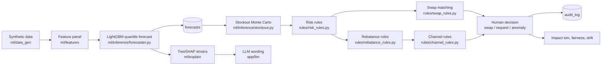
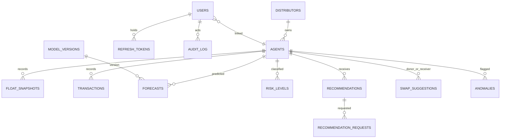

# AgentPulse: কোড-স্তরের পরিচিতি (বাংলা)

> লেখার নিয়ম: প্রতিটি দাবির পাশে `file:line` আছে। যাচাই না হওয়া তথ্য `unverified` লেখা।
> লাইভ সংখ্যা: এই লেখার সময় (2026-10-03) local stack-এ `POST /api/v1/auth/demo-login` দিয়ে পাওয়া। `.env` পড়া হয়নি, কোনো key লেখা হয়নি।
> শব্দার্থ প্রথমবার ব্যাখ্যা করা হয়েছে; পরে একই শব্দ ব্যবহার।

## ০. সংক্ষিপ্ত পরিচিতি

- **AgentPulse** একটি browser-ভিত্তিক web app। native mobile app-এর কোড পাওয়া যায়নি (`unverified`)। Route: `/agent`, `/distributor`, `/admin` (`frontend/src/app/router.tsx:124-126`)।
- **ব্যবহারকারী:** এজেন্ট (cash ও e-money point চালক), ডিস্ট্রিবিউটর (এজেন্টের তদারককারী), অ্যাডমিন।
- **সমস্যা:** এজেন্টের নগদ (cash) বা e-money float (ব্যালেন্স) কখন ফুরোবে তা আগে না জানলে গ্রাহক ফিরে যায়।
- **কাজের ৫ ধাপ:**
  1. synthetic (কৃত্রিম) ডেটা থেকে feature (ইনপুট সংখ্যা) তৈরি।
  2. LightGBM মডেল পরবর্তী ৭২ ঘণ্টার চাহিদার পরিসর দেয় (q10 / q50 / q90)।
  3. Monte Carlo (অনেক র‍্যান্ডম পথ চালিয়ে সম্ভাবনা হিসাব) দিয়ে stockout সময় ও probability।
  4. risk rule (green / amber / red) এবং rebalance ও channel rule পরামর্শ বানায়; swap rule দুই এজেন্টের মিল খোঁজে।
  5. মানুষ approve বা reject করে; প্রতিটি সিদ্ধান্ত `audit_log`-এ যায়।
- **AI-এর কাজ:** ML শুধু সংখ্যা দেয় (forecast, probability)। LLM শুধু ভাষা লেখে (ব্যাখ্যা, chat, briefing); সংখ্যা বানায় না।
- **মানুষের কাজ:** swap approve/reject, recommendation request approve/decline/fulfil, anomaly confirm/dismiss। সিস্টেম নিজে কোনো টাকা সরায় না (`backend/app/api/v1/swaps.py:52-54`, "Advisory: no money moves")।
- **Stack:** React + TypeScript (frontend), FastAPI + SQLAlchemy (backend), PostgreSQL (DB)।
- **এখনকার অবস্থা:** `GET /api/v1/system/status` বলছে `ready: true`, migration `0014`, `llm_mode: openai_compatible`। কিন্তু live LLM call সব `http_404` দিচ্ছে (§৬ দেখুন)।

## ১. বড় ছবি

### ১.ক শব্দার্থ

- **endpoint:** একটি URL ও method (যেমন `GET /api/v1/agents/{id}/forecast`)।
- **handler:** endpoint-এর Python function (`backend/app/api/v1/*.py`)। এটি request পড়ে, permission দেখে, service ডাকে।
- **service:** DB পড়া-লেখা ও ধাপ সাজানো (`backend/app/services/*.py`)।
- **rule:** মানুষের লেখা নির্দিষ্ট নিয়ম; শেখা মডেল নয় (`backend/app/rules/*.py`)।
- **ML:** data থেকে শেখা মডেল (`backend/ml/*`)।
- **quantile (পরিমাণক):** "এর নিচে থাকবে X% সম্ভাবনা" বোঝায়। q10 = ১০% সম্ভাবনায় এর নিচে।
- **holdout:** শেষ ১৪ দিনের ডেটা; training-এ ব্যবহার হয় না, শুধু পরীক্ষায় লাগে।
- **seed:** র‍্যান্ডম সংখ্যার শুরু-বিন্দু। একই seed মানে একই ফল।
- **cache:** আগে হিসাব করে DB-তে রাখা ফল; API শুধু পড়ে।
- **evidence pack:** LLM-কে দেওয়া সংখ্যা ও তথ্যের তালিকা। LLM এর বাইরে কিছু লিখতে পারে না।
- **JWT (access token):** ১৫ মিনিট মেয়াদের সাময়িক পাস; refresh token দিয়ে নতুন পাস নেওয়া যায়।
- **audit_log:** মানুষের প্রতিটি সিদ্ধান্তের লিখিত রেকর্ড (কে, কী, কখন, নোট)।

### ১.খ প্রবাহ

Bootstrap-এর ক্রম: forecast → risk → rebalance (এর ভেতরে swap ও channel) → anomaly scan → backtest (impact ও fairness) (`backend/app/services/pipeline.py:20-45`)। প্রতিটি ধাপ তার input না বদলালে নিজেকে এড়িয়ে যায় (`pipeline.py:21-22`)।

### ১.গ তিন স্তর ও তাদের সীমা

| স্তর | ফোল্ডার | যা করে | যা কখনো করবে না |
|---|---|---|---|
| ML | `backend/ml/` (`features`, `training`, `inference`, `explain`, `artifacts`) | forecast quantile, stockout path, anomaly score, SHAP factor | নিয়মের সিদ্ধান্ত, অনুমোদন, টাকা সরানো। anomaly flag fraud-রায় নয় (`backend/ml/inference/anomaly.py:1-4`) |
| Rules | `backend/app/rules/` + `backend/app/services/` | probability → level (`risk_rules.py:49-60`); need → amount ও deadline (`rebalance_rules.py:66-100`); donor/receiver → feasible swap (`swap_rules.py:76-99`); shortage → channel (`channel_rules.py:188-203`) | নতুন সংখ্যা বানানো বা শেখা |
| LLM | `backend/app/llm/` + `backend/app/api/v1/llm.py`, `copilot.py` | evidence থেকে বাংলা/ইংরেজি বাক্য, chat উত্তর, briefing | সংখ্যা তৈরি, সিদ্ধান্ত, অনুমোদন, টাকা সরানো। numbers guard ও action guard এটি যাচাই করে (`backend/app/llm/guard.py:86-115`) |

## ২. ব্যবহারকারী ও তাদের স্ক্রিন

### ২.১ Public ও shared পেজ

- `/`: role অনুযায়ী home-এ redirect (`frontend/src/app/router.tsx:107`)। `/login`, `/403`, `/404`, `/500` public (`router.tsx:111-114`)।
- `/settings`, `/profile`, `/help`, `/about`, `/notifications`: সব signed-in role (`router.tsx:128-132`)।
- `/responsible-ai`: সব role পড়তে পারে (`frontend/src/app/routes.ts:46`; API role `Reader`, `backend/app/api/v1/responsible_ai.py:15`)।
- `/dev/kit`: শুধু dev বা `VITE_DEV_KIT=true` bundle-এ (`router.tsx:137`)।
- Preference: `PATCH /api/v1/users/me/preferences` (`backend/app/api/v1/users.py:11-12`); profile: `GET` ও `PATCH /users/me/profile` (`users.py:20-26`)।

### ২.২ Agent

**ক) গল্প**
1. লগইন করে আমার point-এর cash ও e-money runway দেখি।
2. Stockout কখন হতে পারে এবং কত probability, তা রঙ দিয়ে জানি।
3. Need থাকলে van, top-up বা self-fetch পরামর্শ দেখি এবং request পাঠাতে পারি।
4. Swap offer এলে donor বা receiver হিসেবে accept বা decline করি; distributor চূড়ান্ত সিদ্ধান্ত নেয়।
5. What-if slider ও Copilot দিয়ে প্রশ্ন করি; উত্তর আমার নিজের data থেকে।

**খ) স্ক্রিন টেবিল**

| Route | Page component | দেখা/করা যায় | API | Handler → service / rule / ML | DB (পড়া / লেখা) | Feature | Permission |
|---|---|---|---|---|---|---|---|
| `/agent` | `AgentHomePage` (`frontend/src/features/agent/home/AgentHomePage.tsx`) | runway, next action | `GET /agents/{id}/summary`, `GET /agents/{id}/recommendation` | `risk.get_summary` (`backend/app/api/v1/risk.py:60`) → `risk_read.agent_summary` (`backend/app/services/risk_read.py:131`); `recommendations.get_recommendation` (`backend/app/api/v1/recommendations.py:10`) → `recommendation_read.agent_recommendation` (`backend/app/services/recommendation_read.py:19`) | r: `stockout_predictions`, `risk_levels`, `recommendations`, `agents` | F1–F4, F6 | `ScopedAgent` (`backend/app/core/deps.py:83`) |
| `/agent/forecast` | `ForecastPage` (`frontend/src/features/agent/forecast/ForecastPage.tsx`) | 72h path, event ribbon, what-if | `GET /agents/{id}/forecast`, `POST /agents/{id}/whatif` | `forecast.get_forecast` (`backend/app/api/v1/forecast.py:13`) → `services/forecast.py:89 agent_forecast`; `whatif.post_whatif` (`backend/app/api/v1/whatif.py:18`) → `services/whatif.py:51 run` | r: `forecasts`, `model_versions`, `events` | F1, F6, F8 | `ScopedAgent` |
| `/agent/stockout` | `StockoutPage` | stockout সময়, confidence, 6/24/72h risk | `GET /agents/{id}/stockout`, `GET /agents/{id}/risk` | `risk.get_stockout` (`risk.py:69`), `risk.get_risk` (`risk.py:78`) → `risk_read.agent_stockout` (`risk_read.py:114`), `risk_read.agent_risk` (`risk_read.py:122`) | r: `stockout_predictions`, `risk_levels` | F2, F3 | `ScopedAgent` |
| `/agent/rebalance` | `RebalancePage` | recommendation, request করা, request status | `GET /agents/{id}/recommendation`, `POST /recommendations/{id}/request`, `GET /recommendation-requests` | `recommendation_requests.create` (`backend/app/api/v1/recommendation_requests.py:39`) → `services/recommendation_requests.py:70`; `list_requests` (`recommendation_requests.py:55`) | r/w: `recommendation_requests`, `recommendations`, `audit_log` | F4 | `AgentUser` (`recommendation_requests.py:21`) + মালিকানা (`services/recommendation_requests.py:76-78`) |
| `/agent/swap` | **`PlaceholderPage`** (scaffold, §৬) | এখন scaffold | (`swaps` router আছে) | `router.tsx:61-69`-এর `AGENT_BUILT`-এ `swap` key নেই → `PlaceholderPage` (`router.tsx:96`) | — | F5 | `AgentUser` (`backend/app/api/v1/swaps.py:17`) |
| `/agent/what-if` | `WhatIfPage` | balance slider | `POST /agents/{id}/whatif` | §গ F8 | (read only) | F8 | `Caller` (`whatif.py:15`) + `ScopedAgent` |
| `/agent/explain` | `ExplainPage` | cash/e-money কারণ | `GET /agents/{id}/explanations`, `POST /explanations/narrate` | `explanations.get_explanations` (`explanations.py:13`) → `services/explanation.py:74 agent_explanation`; `llm.narrate` (`backend/app/api/v1/llm.py:37`) | r: `forecast_explanations`; w: `llm_call_log`, `llm_cache` | F7, LLM | `ScopedAgent`; narrate-এ `can_access_agent` (`llm.py:37-44`) |
| `/agent/copilot` | `CopilotPage` (`frontend/src/features/agent/copilot/CopilotPage.tsx`) | বাংলা/ইংরেজি chat, voice | `POST /copilot/chat` (SSE), `GET /copilot/suggestions` | `copilot.copilot_chat` (`backend/app/api/v1/copilot.py:78`) → `llm/copilot/chat.py:86 answer`; suggestions `copilot.py:88` | r: `copilot_messages`; w: `copilot_messages`, `llm_call_log`, `llm_cache` | LLM | `CurrentUser`; agent অন্য `agent_id` চাইলে 403 (`copilot.py:30-35`) |
| `/agent/settings` | `SettingsPage` | ভাষা, digit, theme | `PATCH /users/me/preferences` | `users.update_preferences` (`users.py:11`) | w: `users` | — | `CurrentUser` |

**গ) Feature deep dive (এজেন্ট যা ছোঁয়)**

**F1 — চাহিদার forecast**
- (i) উদ্দেশ্য: প্রতি agent ও প্রতি float-এর পরবর্তী ৭২ ঘণ্টার cash-out ও cash-in পরিসর।
- (ii) ইনপুট: panel-এর feature তালিকা (`backend/ml/features/build.py:15-21`); lag feature সব origin-এর আগের ডেটা থেকে (`build.py:41-59`, `lag_168` = `t - WEEK_H`)।
- (iii) ধাপ (inference): `forecast.precompute` (`backend/app/services/forecast.py:56-88`) → `Forecaster.load` (`backend/ml/inference/forecaster.py:26`) ছয়টি booster লোড (তিন quantile × দুই target) → `predict_origin` (`forecaster.py:44`) → `forecasts`-এ bulk insert। ধাপ (training): `sample_rows` (`backend/ml/training/train.py:55`) → `fit` (`train.py:70`) → `run` (`train.py:100`) → `evaluate` (`backend/ml/training/evaluate.py:61`)।
- (iv) মান: seed `42` (`backend/app/core/config.py:25`); MAX horizon 72 (`build.py:11`); lag window 168 h (`build.py:13`); training-এর লক্ষ্য holdout-এর আগে (`train.py:4`; holdout শুরু `2026-04-21 00:00 BDT`, `backend/ml/data_gen/timeline.py:14`)।
- (v) output: `AgentForecast` — `as_of`, `horizon_hours`, `model_version`, `generated_at`, `floats[]` (প্রতি point: `low`, `expected`, `high`) (`services/forecast.py:89-116`)।
- (vi) AGT-0001 (agent_id 1), `as_of 2026-04-30T14:00Z`, cash_out: h1 low 13,164.33 / expected 34,772.79 / high 52,174.81; h2 expected 28,335.83 (লাইভ `/agents/1/forecast?horizon=24`)।
- (vii) ব্যর্থতা: artifact বা cache না থাকলে `agent_forecast` `None` দেয়, handler "not ready" দেয় (`forecast.py:89`)। artifact-এর hash না মিললে `Forecaster.load` error দেয় (`forecaster.py:26-30`)।
- (viii) সংখ্যা = MODEL (quantile)। RULE নয়, AI নয়।
- (ix) টেস্ট: `backend/tests/test_forecast.py::test_training_rows_never_touch_holdout`, `::test_inference_features_ignore_future`, `::test_forecast_shapes_and_quantile_order`, `::test_forecast_not_ready_without_cache`; ML gate: `backend/tests/test_ml_gate.py:41` `test_forecast_beats_last_week_baseline`।

**F2 — stockout সময় ও probability**
- (i) উদ্দেশ্য: float কখন শূন্যে নামবে, এবং কত সম্ভাবনায়।
- (ii) ইনপুট: starting balance; drain ও inflow quantile। cash float → drain = cash_out; e-money float → drain = cash_in (`backend/app/models/enums.py:29-30` `FLOAT_DEMAND`); inflow = অন্য target (`backend/app/services/risk.py:80-86`)।
- (iii) ধাপ: `sample_paths` দুটি Gaussian copula দিয়ে hour-ভিত্তিক path (`backend/ml/inference/stockout.py:49-53,73-80`) → `demand_quantile` দুই দিকে linear interpolate (`stockout.py:41-46`) → `first_passage` শূন্য-পার হওয়ার সময় (`stockout.py:54-70`) → `from_paths` CDF, median ও confidence (`stockout.py:82-96`)। caller `services/risk.py:80-98`।
- (iv) মান: `n_paths=2000`, `rho=0.6`, floor 0, confidence window ±25% (min ±1 h) (`stockout.py:18-24`)। path seed `path_rng(seed, agent_id, float_type)` (`services/risk.py:31`)।
- (v) output: `stockout_at`, `hours_to_stockout`, `confidence`, `prob_by_hour` (`services/risk.py:88-98`)।
- (vi) AGT-0001 cash (লাইভ `/agents/1/stockout`): `stockout_at 2026-05-01T13:34:44Z` (BDT 19:34), `hours_to_stockout 23.58`, `confidence 0.378`।
- (vii) hit না হলে `stockout_at = null` (`services/risk.py:91-92`); balance আগে থেকে floor-এ থাকলে `p_now` (`stockout.py:88`)।
- (viii) probability ও মধ্যক সময় = MODEL (Monte Carlo + quantile)। "confidence" শব্দটি এখানে অন্য অর্থে (§৬)।
- (ix) টেস্ট: `backend/tests/test_stockout_projection.py::test_constant_drain_runs_out_mid_hour` (`:28`), `::test_never_runs_out_within_horizon` (`:46`), `::test_known_probability_with_full_path_correlation` (`:58`); `backend/tests/test_risk_api.py::test_stockout_known_answer`।

**F3 — risk label (green / amber / red)**
- (i) উদ্দেশ্য: 6, 24, 72 ঘণ্টার probability-কে রঙে বদলানো।
- (ii) ইনপুট: `P(stockout within h)` (F2) এবং cut-off।
- (iii) ধাপ: `level_for` → `_grade`: `p >= red` → red; `p >= amber` → amber; নইলে green (`backend/app/rules/risk_rules.py:49-60`)। agent-এর level = float-দের worst (`risk_rules.py:87-88`); headline horizon 24 h (`risk_rules.py:15`)।
- (iv) মান (`risk_rules.py:27`): 6h amber 0.10 / red 0.30; 24h 0.20 / 0.50; 72h 0.35 / 0.70। `RISK_THRESHOLDS` দিয়ে বদলানো যায় (`backend/app/core/config.py:60`; `build_config` `risk_rules.py:38-47`)।
- (v) output: `level`, `by_horizon[]` (`horizon_h`, `level`, `probability`), `floats[]` (`backend/app/api/v1/risk.py:78`)।
- (vi) AGT-0001: 6h p 0.0 green; 24h p 0.5205 **red** (≥ 0.50); 72h p 0.6985 amber (≥ 0.35, < 0.70); headline red। e-money float: green (লাইভ `/agents/1/risk`)।
- (vii) সম্ভাবনা শূন্য হলে level green (`rules/risk_rules.py:49-54`)।
- (viii) probability = MODEL; cut-off = RULE; label = RULE; AI নেই।
- (ix) টেস্ট: `backend/tests/test_risk_rules.py::test_default_cut_offs` (`:25`), `::test_cut_at_any_hour_interpolates_between_horizons` (`:29`), `::test_thresholds_from_settings` (`:56`); `backend/tests/test_risk_api.py::test_risk_levels_known_answer`।

**F4 — rebalance (কত, কখন) ও channel (কোন পথে)**
- (i) উদ্দেশ্য: float-এর ঘাটতি কত BDT, কোন সময়সীমায়, কোন পথে পূরণ হবে।
- (ii) ইনপুট: balance, capacity, হালের drain (q90) ও inflow (q10), median stockout সময়।
- (iii) ধাপ:
  1. `assess`: 24 ঘণ্টার `cumsum(drain_high − inflow_low)`; তার সর্বোচ্চ = `peak_drain` (`backend/app/rules/rebalance_rules.py:66-72`)।
  2. `shortfall = max(0, peak_drain − balance)`; শূন্য হলে advice নেই (`rebalance_rules.py:87-92`)।
  3. `amount = min(ceil((shortfall + buffer)/500)×500, floor(free/500)×500)`, `free = capacity − balance` (`rebalance_rules.py:93-99`)।
  4. `stockout_h = min(crossing_h, median_stockout_h)`; `deadline = now + (stockout_h − lead)` (`rebalance_rules.py:100-104`)।
  5. `channel_rules.choose`: e-money → top_up (`channel_rules.py:188-193`); cash → swap (সম্পূর্ণ cover হলে) → van (cluster ≥ ১ lakh) → self_fetch → urgent_manual (`channel_rules.py:188-203`)।
- (iv) মান (`rebalance_rules.py:16-24`, `config.py:62-78`): ROUND 500 BDT; horizon 24 h; lead 3 h; buffer = max(2,000, 10% capacity); van min batch 100,000 BDT; van radius 10 km; van cost 1,500 BDT/trip; top-up fee 0.5%, ETA 0.25 h; self-fetch ≤ 10 km, 15 km/h; urgent manual 2,500 BDT।
- (v) output: `recommendations` — `kind`, `channel`, `van_route_id`, `float_type`, `amount_bdt`, `deadline_at`, `status`, `rationale` (`rule_trace`, `alternatives`) (`backend/app/models/actions.py:23-46`)।
- (vi) AGT-0001 cash (লাইভ `/agents/1/recommendation`): need 560,476.6; shortfall 416,976.6; buffer 40,000; ceil → 457,000; free = 400,000 − 143,500 = 256,500 → **amount 256,500 (capped = true)**। rule-এর `stockout_at` 2026-05-01T03:06Z (balance-পথের crossing ≈ 13.1 h), deadline 2026-05-01T00:06Z। `rule_trace`: emoney ✗, swap ✗ (partner নেই), van ✓ (cluster 63 এজেন্ট, 4,828,500 BDT ≥ 100,000)। alternatives: self_fetch ✓ (1.7 km), urgent_manual ✓ (2,500 BDT), top_up ✗ (cash ডিজিটাল পাঠানো যায় না)। হাতে যাচাই: 40,000 buffer + 416,976.6 = 456,976.6 → 457,000; cap 256,500 — মেলে।
- (vii) cache না থাকলে recommendation unavailable (`recommendation_read.py:19`)। `urgent = true` যখন `left <= 0` (`rebalance_rules.py:104`)।
- (viii) need, amount, deadline, channel = RULE (সংখ্যা MODEL quantile থেকে); "কেন" বাক্য = template (বা LLM, শুধু চাইলে)।
- (ix) টেস্ট: `backend/tests/test_rebalance_rules.py::test_amount_is_shortfall_plus_buffer_and_deadline_is_stockout_minus_lead` (`:27`), `::test_amount_rounds_up_to_500_and_caps_at_free_capacity` (`:36`); `backend/tests/test_channel_rules.py::test_van_batch_threshold` (`:56`), `::test_covering_swap_wins_over_van` (`:34`); `backend/tests/test_recommendation_api.py`।

**F5 — swap (agent-এর সাড়া)**
- (i) উদ্দেশ্য: কাছের দুই agent, একই distributor — একজনের surplus অন্যজনের need মেটাতে পারে।
- (ii) ইনপুট: receiver (need, lat/lng, distributor), donor (surplus, lat/lng, distributor)।
- (iii) ধাপ: `_pair` → একই distributor, আলাদা agent, haversine ≤ 5 km, `amount = floor(min(need, surplus)/500)×500 ≥ 5,000` (`backend/app/rules/swap_rules.py:76-86`); `match` → `linear_sum_assignment` (scipy) সর্বনিম্ন মোট দূরত্বের যোগ্য জোড়া বেছে নেয়, এক agent এক জোড়ায় (`swap_rules.py:89-99`)।
- (iv) মান: radius 5 km; min 5,000 BDT (`swap_rules.py:27-28`); score = `coverage × (1 − distance / radius)`, coverage = `min(1, amount/need)` (`swap_rules.py:84-86`)।
- (v) output: `donor`, `receiver`, `amount_bdt`, `distance_km`, `van_trip_saved`, `score`, `status` (`backend/app/services/swaps.py:52-60`)।
- (vi) distributor-এর লাইভ `/swaps`: #16 AGT-0004 → AGT-0018, 49,000 BDT, 0.27 km, score 0.9463, pending। AGT-0001 এই তালিকায় আছে কিনা: `unverified` (পুরো তালিকা দেখা হয়নি)।
- (vii) agent `respond` করলে donor বা receiver response সেট হয় (`services/swaps.py:128-141`)। কেউ decline করলে approve আটকে যায় (`services/swaps.py:118-119`)।
- (viii) match = RULE + scipy optimiser; score = সহজ গাণিতিক সূত্র; AI নেই।
- (ix) টেস্ট: `backend/tests/test_swap_rules.py::test_assignment_minimises_total_distance` (`:27`), `::test_infeasible_pairs_are_never_matched` (`:34`); `backend/tests/test_swaps_api.py::test_agent_response_is_audited_and_decline_blocks_approval` (`:118`)।

**F6 — event ও calendar**
- (i) উদ্দেশ্য: বেতন দিবস, Eid, হাটবার, বৃষ্টি বা ঝড়ের প্রভাব দেখানো।
- (ii) ইনপুট: `events` (type, `name_en`, `name_bn`, `starts_at`, `ends_at`, `district`, `intensity`) ও `weather_daily` (`backend/app/models/timeseries.py:58-80`)।
- (iii) ধাপ: forecast feature — `ev_salary`, `ev_wage`, `ev_eid_day`, `ev_holiday`, `ev_hat`, `ev_severe_weather` (`backend/ml/features/build.py:17-18`)। event বদলালে cache আবার হিসাব হয়: `events_fingerprint` (`backend/app/services/forecast.py:40-47`)।
- (iv) মান: Eid = 2026-03-21 (`backend/ml/data_gen/calendar_effects.py:28`); হাট ঘণ্টা 9–16 (`calendar_effects.py:49`); garment দিন 7–9 (`calendar_effects.py:24`)। `SALARY` দিনের সীমা: `unverified`।
- (v) output: `EventPage` (`backend/app/api/v1/events.py:25-37`)।
- (vi) AGT-0001 এর বেতন দিবসের প্রভাব: +182,000 BDT (নিচে F7)।
- (vii) CRUD শুধু admin (`events.py:16,40-62`); পড়া সব signed-in user (`events.py:27`)।
- (viii) event = ডেটা (RULE); প্রভাব = MODEL (feature weight)। AI নেই।
- (ix) টেস্ট: `backend/tests/test_events_api.py::test_roles`, `::test_admin_crud_with_audit`; `backend/tests/test_explanations.py::test_event_change_refreshes_cache`, `::test_cached_drivers_tell_the_salary_story`।

**F7 — "কেন?" ব্যাখ্যা**
- (i) উদ্দেশ্য: forecast কেন উঁচু বা নিচু, তার কারণ।
- (ii) ইনপুট: cached forecast origin-এ TreeSHAP contribution (LightGBM `pred_contrib=True`, `backend/ml/explain/factors.py:3,47`)।
- (iii) ধাপ: `window_shap` (`backend/ml/explain/factors.py:40`) → top ৩ factor (`backend/ml/explain/drivers.py:11` `TOP_K = 3`) → `reasons` (`backend/app/services/explanation.py:66`) → template বাক্য (`backend/ml/explain/templates.py`)। `agent_explanation` (`explanation.py:74`) বাংলা ও ইংরেজি জানে।
- (iv) মান: explain window 24 h (`factors.py:17`)।
- (v) output: `usual_bdt`, `reasons[]` (`factor`, `impact`, `direction`, `share`, `sentence`), `generated_by` (`backend/app/api/v1/explanations.py:13-20`)।
- (vi) AGT-0001 cash_out, 24 h, `lang=en`, `generated_by=template` (লাইভ): usual 300,828.82; salary +182,000 (share 0.561, up); weekday −35,400 (0.109, down); time_of_day −32,500 (0.10, down)।
- (vii) `POST /explanations/narrate`: LLM শুধু বাক্য লেখে; SHAP সংখ্যা বাইরে থেকে আসে; LLM ব্যর্থ হলে template (`backend/app/llm/service.py:186-203`)।
- (viii) impact সংখ্যা = MODEL (SHAP); factor নাম = RULE (template map); বাক্য = template বা AI (`generated_by` লেবেলে দেখা যায়)।
- (ix) টেস্ট: `backend/tests/test_explanations.py::test_shap_adds_up_to_the_median_forecast` (`:40`), `::test_explanations_en_bn`; `backend/tests/test_explain_templates.py`।

**F8 — What-if slider**
- (i) উদ্দেশ্য: "২০,০০০ BDT যোগ করলে কী হতো?"।
- (ii) ইনপুট: `{float_type, delta_amount}`; `|delta| ≤ 10,000,000` (`backend/app/schemas/whatif.py:8-15`, `MAX_DELTA_BDT`)।
- (iii) ধাপ: `whatif.run` (`backend/app/services/whatif.py:51`) একই seed-এর path-এ দুটি balance — `before = b0`, `after = b0 + delta` (`backend/ml/inference/whatif.py:35-41`)। p10/p50/p90 band `balance_bands` (`whatif.py:23-27`)। নতুন training নেই।
- (iv) মান: একই path, তাই শুধু balance বদলায়।
- (v) output: `before`, `after` (প্রতিটিতে balance, `stockout_at`, `hours_to_stockout`, `horizons`, `series`), `capacity`, `as_of` (`backend/app/schemas/whatif.py`)।
- (vi) AGT-0001 +20,000 cash (লাইভ): balance 143,500 → 163,500; 24 h probability 0.5205 → 0.475 (red → amber); `hours_to_stockout` 23.58 → 24.47; 72 h 0.6985 → 0.679।
- (vii) delta = 0 হলে নতুন হিসাব হয় না; frontend cache থেকে পড়ে (`frontend/src/api/hooks/agents.ts:89-94`, `enabled: delta !== 0`)।
- (viii) সব সংখ্যা = MODEL re-projection; user input = hypothetical।
- (ix) টেস্ট: `backend/tests/test_whatif_api.py::test_before_equals_cache_and_after_moves_runway`, `::test_positive_delta_never_worsens_risk`, `::test_bounds_are_validated`, `::test_latency_under_300_ms`।

**LLM — Copilot chat (এজেন্ট)**
- (i) উদ্দেশ্য: "আমার cash কখন ফুরোবে?", "swap-এর অবস্থা কী?" — বাংলায় উত্তর।
- (ii) ইনপুট: `message`, `agent_id`, `lang`; SSE stream (`backend/app/api/v1/copilot.py:78-86`)।
- (iii) ধাপ: `route()` (`backend/app/llm/copilot/intents.py:125`): injection → blocked (`intents.py:43-57`); domain শব্দ না থাকলে off-topic; what-if → tool; how-to ও RAG hit → playbook; swap/status/forecast শব্দ → tool। tool তালিকা শুধু তিনটি (`backend/app/llm/copilot/tools.py:23` `ALLOWED`; `execute` `tools.py:134`)। `plan` (`copilot/chat.py:38`) pack বানায়; `answer` (`chat.py:86`) refusal ছাড়া `service.generate` ডাকে; উত্তর চার শব্দের অংশে SSE `delta` হিসেবে যায় (`chat.py:27`; `copilot.py:53`)।
- (iv) মান: window ডিফল্ট ২৪ ঘণ্টা (`intents.py:19`); RAG top 3 ও min score 0.12 (`backend/app/llm/rag.py:20-21`)।
- (v) output: `CopilotReply` (`answer`, `route`, `generated_by`, `model_version`) (`chat.py:86-98`)।
- (vi) লাইভ LLM এখন `http_404` দেয়; উত্তর template। `/llm/status`: `calls_today 20`, `last_error: error`।
- (vii) সীমা: user-প্রতি 10 call/min (`backend/app/llm/limits.py:5`); দিনে সর্বোচ্চ 500 live call (`config.py:90`); injection ও off-topic-এ LLM call হয় না (`chat.py:86-96`)।
- (viii) সংখ্যা = pack থেকে (MODEL/RULE); ভাষা = AI বা template; `generated_by` লেবেল থাকে।
- (ix) টেস্ট: `backend/tests/test_copilot_routing.py::test_injection_and_other_agents_are_blocked`, `::test_rag_top_hit`, `::test_tool_allow_list_rejects`, `::test_leak_guard`; `backend/tests/test_prompt_injection.py::test_router_blocks` (`:58`), `::test_blocked_attack_never_reaches_the_model` (`:63`), `::test_obedient_model_output_is_rejected` (`:120`)।

### ২.৩ Distributor

**ক) গল্প**
1. আমার territory-র সব agent-এর risk একটি map ও table-এ দেখি।
2. Swap proposal দেখে approve বা reject করি, অবশ্যই একটি নোট দিয়ে।
3. Agent-এর recommendation request approve বা decline করি এবং fulfil নথিভুক্ত করি।
4. Anomaly তালিকা থেকে investigate করে confirm বা dismiss করি।
5. Impact (AI বনাম fixed rule) ও Responsible-AI পেজ পড়ি; briefing পড়ি।

**খ) স্ক্রিন টেবিল**

| Route | Page component | দেখা/করা যায় | API | Handler → service / rule / ML | DB | Feature | Permission |
|---|---|---|---|---|---|---|---|
| `/distributor` | `ControlRoomPage` (`frontend/src/features/distributor/controlRoom/ControlRoomPage.tsx`) | map, 0–72h scrubber, swap droplet | `GET /map/agents?at_hour=`, `GET /swaps` | `risk_map.get_map_agents` (`backend/app/api/v1/risk_map.py:18`) → `services/risk_map.py:63 map_agents`; `swaps.list_swaps` (`swaps.py:25`) | r: `agents`, `stockout_predictions`, `swap_suggestions` | F3, F5, F10 | `Viewer` = distributor/admin (`risk_map.py:15`) |
| `/distributor/agents` | `AgentsPage` | filter, sort, CSV | `GET /agents/risk`, `GET /agents/risk/export.csv` | `risk.list_risk` (`risk.py:21`) → `risk_read.risk_page` (`risk_read.py:172`); CSV `risk.export_risk` (`risk.py:41`) | r: `risk_levels`, `agents` | F3 | `CurrentUser` + service-এ scope (`risk_read.py:172`) |
| `/distributor/agents/:id` | `AgentDetailPage` | summary, forecast, recommendation, explanation | `GET /agents/{id}/summary`, `/forecast`, `/recommendation`, `/explanations` | §২.২-এর একই handler ও service | একই | F1–F4, F7 | `ScopedAgent` (`deps.py:83-96`) |
| `/distributor/swaps` | `SwapsPage` (`frontend/src/features/distributor/swaps/SwapsPage.tsx`) | filter, approve/reject (নোটসহ), CSV | `GET /swaps`, `POST /swaps/{id}/decision`, `GET /swaps/export.csv` | `swaps.decide` (`backend/app/api/v1/swaps.py:52`) → `services/swaps.py:112 decide` | r/w: `swap_suggestions`, `audit_log` | F5 | `Distributor` (`swaps.py:16`) + `_load` scope (`services/swaps.py:91-99`) |
| `/distributor/anomalies`, `/:id` | `AnomaliesPage` | তালিকা, evidence, narrative, review | `GET /anomalies`, `GET /anomalies/{id}`, `POST /anomalies/{id}/review`, `GET /anomalies/{id}/narrative` | `anomalies.list_anomalies` (`anomalies.py:29`), `review_anomaly` (`anomalies.py:52`) → `services/anomalies.py:114 review`; LLM `llm.anomaly_narrative` (`llm.py:61`) | r/w: `anomalies`, `audit_log` | F9, LLM | `Reviewer` (`anomalies.py:15`) |
| `/distributor/impact` | `ImpactPage` (`frontend/src/features/distributor/impact/ImpactPage.tsx`) | AI বনাম baseline: stockout ঘণ্টা, BDT, van trip | `GET /impact/summary`, `GET /impact/comparison` | `impact.get_summary` (`backend/app/api/v1/impact.py:23`) → `services/impact_read.py:135 summary`; `get_comparison` (`impact.py:32`) → `impact_read.py:156` | r: `impact_results`, `system_meta` | F11 | `Viewer` (`impact.py:14`) |
| `/distributor/briefing` | `BriefingPage` | দৈনিক সারাংশ | `GET /distributor/briefing?lang=` | `llm.distributor_briefing` (`llm.py:76`) → `llm/packs.py:121 distributor` → `llm/service.py:186 generate` | r: `risk_levels`, `agents`; w: `llm_call_log`, `llm_cache` | LLM | `Reviewer` (`llm.py:23`) |
| `/responsible-ai` | `ResponsibleAiPage` (`frontend/src/features/responsibleAi/ResponsibleAiPage.tsx`) | fairness group, model card | `GET /responsible-ai/fairness`, `GET /responsible-ai/model-card` | `responsible_ai.get_fairness` (`responsible_ai.py:19`) → `services/fairness.py:165 read`; `get_model_card` (`responsible_ai.py:32`) → `services/model_card.py:52 model_card` | r: `system_meta`, `model_versions` | F12 | `Reader` (`responsible_ai.py:15`) |

**গ) Feature deep dive (ডিস্ট্রিবিউটর যা ছোঁয়)**

F3, F4, F5-এর ধাপ ও সীমা উপরে এজেন্ট অংশে আছে; এখানে শুধু distributor-এর সিদ্ধান্ত অংশ (§ঘ)।

**F9 — Anomaly (Isolation Forest)**
- (i) উদ্দেশ্য: এজেন্টের হালের ৭ দিনের আচরণ তার peer group-এর তুলনায় অস্বাভাবিক কিনা।
- (ii) ইনপুট: চার raw feature — `cash_out_growth`, `hour_shift`, `refills_per_day`, `out_in_log_ratio` (`backend/ml/features/anomaly.py:31`); peer z-score (`anomaly.py:32`)।
- (iii) ধাপ: `anomaly_scan.precompute` (`backend/app/services/anomaly_scan.py:33`) → প্রতি agent-এর ৭ দিনের window (`features/anomaly.py:24` STRIDE 24 h) → `Detector` (`backend/ml/inference/anomaly.py:16`, `load_detector` `:37`) → threshold ছাড়ালে flag। reviewed flag আর পুনরায় flag হয় না (`anomaly_scan.py:4-8` docstring)।
- (iv) মান: IsolationForest 200 tree (`backend/ml/training/anomaly.py:43`); contamination 0.005 (`:46`); ন্যূনতম peer 10 (`features/anomaly.py:26`)। লাইভ: AGT-0005 score 0.7868 > threshold 0.7255।
- (v) output: `score`, `threshold`, `peer_group`, `reasons[]` (feature, value, peer_median, deviation, direction), `status` (`backend/app/services/anomalies.py:56-68`)।
- (vi) লাইভ AGT-0005 (Krishi Market Varieties): `hour_shift` 0.6727 বনাম peer median 0.062 (deviation 12.21); `cash_out_growth` 1.0319 বনাম −0.0589 (deviation 8.61)।
- (vii) reviewed হলে status বদলায় না (`services/anomalies.py:118-119` `already_reviewed`); নতুন flag এক বার নোটিফাই (`backend/tests/test_anomalies_api.py::test_new_flags_notify_own_distributor_once`, `:201`)।
- (viii) score ও flag = MODEL; peer group ও "reasons" = MODEL থেকে; narrative = LLM বা template; decision = মানুষ।
- (ix) টেস্ট: `backend/tests/test_anomaly_features.py::test_window_features_single_out_the_odd_agent`, `::test_hour_shift_zero_for_same_shape_and_one_for_disjoint`; `backend/tests/test_anomalies_api.py::test_demo_agent_is_flagged_with_reasons` (`:79`), `::test_review_is_audited_and_final` (`:139`), `::test_admin_can_dismiss` (`:167`)।

**F10 — Map risk ও time scrubber**
- (i) উদ্দেশ্য: ০–৭২ ঘণ্টায় কোন agent কোথায় লাল বা হলুদ।
- (ii) ইনপুট: cached `stockout_predictions.prob_by_hour` (প্রতি ঘণ্টার probability)।
- (iii) ধাপ: `_float_levels` (`backend/app/services/risk_map.py:24`) `at_hour`-এ cut-off interpolate করে (`backend/app/rules/risk_rules.py:77-79` `level_at`); `_swaps` (`risk_map.py:41`); `map_agents` (`risk_map.py:63`)।
- (iv) মান: cut-off 6/24/72 h-এর মধ্যে linear (`risk_rules.py:61-68` `cut_at`)।
- (v) output: `MapAgents` — agents (lat, lng, levels) ও swap droplet।
- (vi) AGT-0001-এর coordinates (23.8069, 90.3687) লাইভ `/agents/1/summary`-এ।
- (vii) বাইরের CARTO tiles শুধু "online" লেয়ারে (`frontend/src/features/distributor/controlRoom/mapStyle.ts:21` `TILES`); ডিফল্ট বন্ধ (`mapStyle.ts:58`)। boundary GeoJSON স্থানীয় (`frontend/public/geo/bangladesh.geojson`)। offline-এ tiles ছাড়া কী দেখায়: `unverified` (ব্রাউজারে চালানো হয়নি)।
- (viii) level = RULE; তার উৎস probability = MODEL।
- (ix) টেস্ট: `backend/tests/test_map_api.py::test_levels_move_with_the_scrubber`, `::test_matches_the_risk_cache_at_its_horizons`, `::test_role_scoped`।

**F11 — Impact (AI বনাম fixed threshold)**
- (i) উদ্দেশ্য: শেষ ১৪ দিনের holdout-এ ধরে নেওয়া, AI policy বনাম "balance < ২০% capacity হলে alert" baseline।
- (ii) ইনপুট: holdout demand, opening balance, scheduled refill, policy। সব policy একই "দুনিয়া" দেখে (`backend/app/services/impact_sim.py:92` `run`)।
- (iii) ধাপ: প্রতি ঘণ্টায় refill → delivery পৌঁছায় → policy order → customer served → balance বদলায় (`impact_sim.py` header docstring)। baseline alert `backend/app/rules/impact_rules.py:63` `baseline_alerts`; AI planning round ৮, ১৪, ২০ (`impact_rules.py:30`); arrival `impact_rules.py:52`; cash-out fee 1.85% (`impact_rules.py:34`)।
- (iv) মান: alert share 0.20 (`impact_rules.py:27`); van 1,500 BDT (`impact_rules.py:35`); emergency ETA 3 h (`impact_rules.py:33`)।
- (v) output: `model` ও `baseline` totals, `delta` (`stockout_hours_reduced`, `value_saved_bdt`, `van_trips_avoided`) (`services/impact_read.py:50` `_delta`, `:135` `summary`)।
- (vi) লাইভ DST-DHK, 2026-04-21 → 05-04, 110 agent: AI stockout 16.0 h বনাম baseline 105.0 h (−89.0, −84.8%); value lost 108,802.28 বনাম 788,006.49 (saved 679,204.21); **van trip AI 338 বনাম baseline 203 → `van_trips_avoided = −135`** (AI বেশি trip নিয়েছে)।
- (vii) `impact_results` cache না থাকলে `_not_ready` (`backend/app/api/v1/impact.py:19`)।
- (viii) সব সংখ্যা = SIMULATION (MODEL + rule replay)। বাস্তব ledger নয়।
- (ix) টেস্ট: `backend/tests/test_impact_rules.py::test_baseline_alerts_once_until_delivery` (`:37`), `::test_business_hours` (`:21`); `backend/tests/test_impact_api.py::test_rows_and_cache`, `::test_summary_is_consistent`; `backend/tests/test_impact_sim.py`।

**F12 — Fairness ও model card**
- (i) উদ্দেশ্য: বিভিন্ন agent group-এ AI-এর forecast error ও stockout recall সমান কিনা।
- (ii) ইনপুট: holdout planning round-এর forecast ও logged served demand (`backend/app/services/fairness.py:1-12` docstring)।
- (iii) ধাপ: `accumulate` (`fairness.py:78`) → `report` (`fairness.py:135`) → `store` (`fairness.py:146`) → `read` (`fairness.py:165`); gap `gaps` (`fairness.py:177`)।
- (iv) মান: stockout cut-off = `amber_cut` (`fairness.py:78`)।
- (v) output: `FairnessReport` (group ভিত্তিক MAE ও recall, gap); `ModelCard` (`advisory_only: true`, human oversight লেখা, models) (`backend/app/services/model_card.py:52`)।
- (vi) model card লাইভ: `demand_forecast`, version `lgbq-1.0.0-56571e7f`।
- (vii) কোনো fairness "গ্যারান্টি" নয়; limitations লেখা থাকে।
- (viii) সব সংখ্যা = MODEL/SIMULATION; LLM নয়।
- (ix) টেস্ট: `backend/tests/test_impact_api.py::test_fairness_by_group`, `::test_model_card`।

**LLM — Distributor briefing ও anomaly narrative**
- (i) উদ্দেশ্য: জটিল অবস্থার ছোট বাংলা সারাংশ।
- (ii) ইনপুট: `distributor` pack (`backend/app/llm/packs.py:121`) বা `anomaly` pack (`packs.py:101`)।
- (iii) ধাপ: `llm.py:76` / `:61` → `packs` → `templates.render` (draft, `backend/app/llm/templates.py:161`) → `service.generate` (cache → live → replay → template)।
- (iv) মান: একই §৪.৯ LLM মান।
- (v) output: `LlmText` (`text`, `generated_by`, `provider`, `model`, `guard_result`, `fallback_reason`, `cached`) (`backend/app/llm/service.py:68-78`)।
- (vi) লাইভ এখন http_404 → template; `/admin/llm/logs`-এ সাম্প্রতিক সব সারি `error` বা `http_404`।
- (vii) LLM ব্যর্থ, daily cap শেষ, rate limit বা guard fail → template (`service.py:121-162`)।
- (viii) সংখ্যা = pack (MODEL/RULE); ভাষা = AI বা template।
- (ix) টেস্ট: `backend/tests/test_llm_api.py::test_distributor_briefing`, `::test_anomaly_narrative`, `::test_timeout_retries_once_then_template`; `backend/tests/test_llm_guard.py::test_numbers_from_pack_pass_in_both_scripts` (`:19`), `::test_invented_numbers_and_times_fail` (`:26`)।

**ঘ) মানুষের সিদ্ধান্ত (distributor)** — পূর্ণ তালিকা §২.৫-এ। সংক্ষেপে: swap approve/reject (নোট বাধ্যতামূলক), recommendation request approve/decline/fulfil, anomaly confirm/dismiss (নোট বাধ্যতামূলক)।

### ২.৪ Admin

**ক) গল্প**
1. সিস্টেম ready কিনা, কোন model active, কোন job চলছে — overview-তে দেখি।
2. Synthetic data-র summary ও assumptions দেখি; নতুন data বা retrain job শুরু করি।
3. Events (বেতন, Eid, বৃষ্টি) যোগ, বদল, মুছি।
4. Users তৈরি, বদল বা নিষ্ক্রিয় করি।
5. Audit log ও LLM call log দেখি; drift (forecast ভুল বাড়ছে কিনা) পর্যবেক্ষণ করি।

**খ) স্ক্রিন টেবিল**

| Route | Page component | দেখা/করা যায় | API | Handler → service | DB | Feature | Permission |
|---|---|---|---|---|---|---|---|
| `/admin` | `AdminOverviewPage` (`frontend/src/features/admin/overview/AdminOverviewPage.tsx`) | readiness, model, open queue, recent audit | `GET /admin/overview`, `GET /system/status` | `admin.get_overview` (`backend/app/api/v1/admin.py:42`) → `services/admin_overview.py` | r: `users`, `agents`, `model_versions`, `audit_log` | ops | `Admin` (`admin.py:31`) |
| `/admin/events` | `AdminEventsPage` | event তালিকা, তৈরি, বদল, মোছা | `GET/POST /events`, `PUT/DELETE /events/{id}` | `events.create_event` (`backend/app/api/v1/events.py:40`) → `services/events.py:82 create`; `update` (`services/events.py:91`); `delete` (`services/events.py:100`) | w: `events`, `audit_log` | F6 | `Admin` (`events.py:16`) |
| `/admin/data` | `AdminDataPage` | row count, period, assumptions | `GET /admin/data`, `GET /admin/data/assumptions` | `admin_ops.get_data` (`backend/app/api/v1/admin_ops.py:31`) → `services/admin_data.py:39 summary` | r: count সমূহ | ops | `Admin` (`admin_ops.py:28`) |
| `/admin/models` | `AdminModelsPage` | registry, holdout metric, job শুরু, drift | `GET /admin/models`, `GET /admin/drift`, `GET/POST /admin/jobs` | `admin_ops.get_models` (`admin_ops.py:46`); `get_drift` (`admin_ops.py:52`) → `services/drift.py:69 report`; `start_job` (`admin_ops.py:78`) → `services/jobs.py:114 start` | r: `model_versions`, `admin_jobs`; w: `admin_jobs`, `audit_log` | F1, F9, F12 (ops) | `Admin` |
| `/admin/users` | `AdminUsersPage` | তালিকা, filter, তৈরি, role/status বদল | `GET/POST /admin/users`, `PATCH /admin/users/{id}`, `GET /admin/org` | `admin.list_users` (`admin.py:50`); `create_user` (`admin.py:64`) → `services/admin_users.py:125 create`; `update_user` (`admin.py:75`) → `services/admin_users.py:144 update_user` | r/w: `users`, `refresh_tokens` (বাতিল), `audit_log` | ops | `Admin` |
| `/admin/audit` (ও `/admin/audit-log`) | `AuditLogPage` (`frontend/src/features/admin/audit/AuditLogPage.tsx`) | filter, CSV | `GET /admin/audit-log`, `GET /admin/audit-log/export.csv` | `admin.list_audit` (`admin.py:108`) → `services/admin_audit.py:59 audit_page`; `export_audit_log` (`admin.py:116`) → `services/exports.py:41 audit_rows` | r: `audit_log`, `users` | ops | `Admin` |
| `/admin/llm` | `AdminLlmPage` | mode, call log, usage, cap | `GET /admin/llm/logs`, `GET /admin/llm/usage`, `GET /llm/status` | `admin_ops.llm_logs` (`admin_ops.py:96`) → `services/admin_llm.py:32 log_page`; `llm_usage` (`admin_ops.py:113`) → `admin_llm.py:62 usage` | r: `llm_call_log`, `llm_cache` | LLM (ops) | `Admin` |

**গ) Ops deep dive**

**Retrain ও data-generate job**
- (i) উদ্দেশ্য: `generate_data`, `retrain_forecast`, `retrain_anomaly` — এক সময়ে একটি।
- (ii) ইনপুট: `JobIn.kind` (`backend/app/schemas/jobs.py:6` `JobKind`)।
- (iii) ধাপ: `start_job` (`admin_ops.py:78`) → `jobs.start` (`backend/app/services/jobs.py:114`): আগে চালু job থাকলে 409 `job_running`; `admin_jobs` সারি `queued`; `audit_log` সারি `job.<kind>` (`services/jobs.py:124`); response 202; `background.add_task(jobs.run, ...)` (`admin_ops.py:90`) → `jobs.run` (`services/jobs.py:226`)।
- (iv) মান: stale সীমা 60 মিনিট (`services/jobs.py:33`); retrain rounds = `train.ROUNDS` (`services/jobs.py:34`)।
- (v) output: `JobOut` (progress, step, error, result)।
- (vi) লাইভে job চালানো হয়নি; শুধু তালিকা পড়া হয়নি (`unverified`)।
- (vii) restart-এ `mark_interrupted` (`services/jobs.py:129`); নতুন model `is_active = false`, serving আগেরটা রাখে (`admin_ops.py:81-83` docstring)।
- (viii) সব MODEL/ops; AI নেই।
- (ix) টেস্ট: `backend/tests/test_admin_ops_api.py::test_job_runs_in_background_with_progress`, `::test_one_job_at_a_time_and_stale_jobs_expire`, `::test_mark_interrupted`, `::test_retrain_forecast_records_inactive_version`।

**Drift**
- (i) উদ্দেশ্য: forecast-এর ভুল কি সময়ের সাথে বাড়ছে।
- (ii) ইনপুট: active model-এর `mae_by_horizon_h` (reference) ও `transactions` (live)।
- (iii) ধাপ: `report` (`backend/app/services/drift.py:69`) → প্রতি float ও বাকেট (1–6, 7–24, 25–72 h) → ratio = live MAE ÷ reference MAE।
- (iv) মান: `WATCH_RATIO = 1.2` (`drift.py:24`); `DRIFT_RATIO = 1.5` (`drift.py:25`)।
- (v) output: `DriftReport` — `floats[].buckets[]` (`mae`, `reference_mae`, `ratio`, `status`)।
- (vi) লাইভ: cash, 7–24 h বাকেট ratio 1.282 → **watch**; 1–6 h ratio 0.559 stable; 25–72 h ratio 1.116 stable।
- (vii) live ডেটা না থাকলে `no_data`।
- (viii) সংখ্যা = MODEL; status = RULE threshold।
- (ix) টেস্ট: `backend/tests/test_admin_ops_api.py::test_models_and_drift`, `::test_models_and_drift_need_a_model`।

### ২.৫ মানুষের অনুমোদন প্রবাহ (সব)

| প্রবাহ | অবস্থা (state) | কে বদলাতে পারে | নোট | `audit_log.action` | কোড |
|---|---|---|---|---|---|
| Swap — distributor | `pending` → `approved` / `rejected` | Distributor (নিজের distributor-এর মধ্যে) | বাধ্যতামূলক, ১–৫০০ অক্ষর (`backend/app/schemas/swap.py:8,44-46`) | `swap.approve` / `swap.reject` | `services/swaps.py:112-125`; `api/v1/swaps.py:52-61` |
| Swap — agent | `donor_response` / `receiver_response`: accepted বা declined | donor বা receiver নিজে | ঐচ্ছিক (`schemas/swap.py:49-51`) | `swap.accept` / `swap.decline` (+ `side`) | `services/swaps.py:128-141`; `api/v1/swaps.py:64-70` |
| Swap — নিষ্পন্ন হলে | আর বদলানো যায় না | — | — | `already_decided` (`SwapError`) | `services/swaps.py:112-141` |
| Recommendation request | `requested` → `approved` (approve), `declined` (decline), `cancelled` (agent cancel), `fulfilled` (approved থেকে) | Distributor: approve/decline/fulfil; Agent: cancel | approve/decline-এ note-এর schema আছে (`schemas/recommendation_request.py:41-43`) | `recommendation_request.create/approve/decline/fulfil/cancel` | `services/recommendation_requests.py:22-28` (`TRANSITIONS`), `:112-127` (transition), `:61-68` (_audit) |
| Anomaly review | `open` → `confirmed` / `dismissed` | Distributor বা Admin (নিজের agent scope) | বাধ্যতামূলক, ১–৫০০ অক্ষর (`schemas/anomaly.py:8,91-93`) | `anomaly.confirmed` / `anomaly.dismissed` | `services/anomalies.py:114-127`; `api/v1/anomalies.py:52-56` |
| Event CRUD | create / update / delete | Admin | নেই | `events.create/update/delete` | `services/events.py:60-102` |
| User admin | create; update (role, link, enable/disable) | Admin | update-এ `note` (`admin_users.py:174`) | `users.create`; `users.update`; `users.disable` / `users.enable` | `services/admin_users.py:119-175` |
| Job start | queued | Admin | নেই | `job.<kind>` | `services/jobs.py:114-124` |
| Demo-login | success / denied / rate_limited | নিজে | নেই | `auth.demo_login` | `services/auth.py:123-154`; `api/v1/auth.py:91-110` |

মন্তব্য: login success/failure audit-এ নেই; শুধু `login_failures` টেবিলে ব্যর্থতা থাকে (`services/auth.py:85-112`)। logout ও password change-এর জন্য audit লেখার কোড পাওয়া যায়নি (`backend/app/services/auth.py:194-220`)।

## ৩. Feature-to-function matrix

| Feature | Frontend component | Endpoint | Handler | Core function / model / rule | DB | Test (file::name) |
|---|---|---|---|---|---|---|
| F1 Forecast | `ForecastPage` | `GET /agents/{id}/forecast` | `backend/app/api/v1/forecast.py:13` | `services/forecast.py:89 agent_forecast`; `ml/inference/forecaster.py:26,44` | `forecasts`, `model_versions` | `test_forecast.py::test_forecast_shapes_and_quantile_order`; `test_ml_gate.py:41` |
| F2 Stockout | `StockoutPage` | `GET /agents/{id}/stockout` | `api/v1/risk.py:69` | `services/risk_read.py:114`; `ml/inference/stockout.py:82,97` | `stockout_predictions` | `test_stockout_projection.py::test_constant_drain_runs_out_mid_hour` (`:28`) |
| F3 Risk | `StockoutPage`, `AgentsPage` | `GET /agents/{id}/risk`, `GET /agents/risk` | `api/v1/risk.py:21,78` | `rules/risk_rules.py:49-60`; `services/risk_read.py:172` | `risk_levels` | `test_risk_rules.py::test_default_cut_offs` (`:25`) |
| F4 Rebalance / channel | `RebalancePage` | `GET /agents/{id}/recommendation`; `POST /recommendations/{id}/request` | `api/v1/recommendations.py:10`; `recommendation_requests.py:39` | `rules/rebalance_rules.py:66-100`; `rules/channel_rules.py:188-203`; `services/rebalance.py:195` | `recommendations`, `recommendation_requests` | `test_rebalance_rules.py::test_amount_is_shortfall_plus_buffer_and_deadline_is_stockout_minus_lead` (`:27`) |
| F5 Swap | `SwapsPage` (distributor), `RebalancePage` (agent) | `GET /swaps`; `POST /swaps/{id}/decision`; `POST /swaps/{id}/respond` | `api/v1/swaps.py:25,52,64` | `rules/swap_rules.py:76-99`; `services/swaps.py:112,128` | `swap_suggestions`, `audit_log` | `test_swap_rules.py::test_assignment_minimises_total_distance` (`:27`); `test_swaps_api.py::test_decision_requires_note_and_is_audited` |
| F6 Event | `ForecastPage`, `AdminEventsPage` | `/events` CRUD | `api/v1/events.py:25-62` | `services/events.py:82-102`; `ml/explain/facts.py` | `events`, `audit_log` | `test_events_api.py::test_admin_crud_with_audit` |
| F7 Explain | `ExplainPage` | `GET /agents/{id}/explanations`; `POST /explanations/narrate` | `api/v1/explanations.py:13`; `api/v1/llm.py:37` | `services/explanation.py:74`; `ml/explain/factors.py:40`; `ml/explain/drivers.py:11` | `forecast_explanations`, `llm_cache`, `llm_call_log` | `test_explanations.py::test_shap_adds_up_to_the_median_forecast` (`:40`) |
| F8 What-if | `WhatIfPage` | `POST /agents/{id}/whatif` | `api/v1/whatif.py:18` | `services/whatif.py:51`; `ml/inference/whatif.py:35` | (শুধু পড়া) | `test_whatif_api.py::test_before_equals_cache_and_after_moves_runway` |
| F9 Anomaly | `AnomaliesPage` | `GET /anomalies`; `POST /anomalies/{id}/review` | `api/v1/anomalies.py:29,52` | `services/anomaly_scan.py:33`; `ml/inference/anomaly.py:16` | `anomalies`, `audit_log` | `test_anomalies_api.py::test_review_is_audited_and_final` (`:139`) |
| F10 Map | `ControlRoomPage` (`RiskMap.tsx`) | `GET /map/agents` | `api/v1/risk_map.py:18` | `services/risk_map.py:63`; `rules/risk_rules.py:77` | `agents`, `stockout_predictions`, `swap_suggestions` | `test_map_api.py::test_role_scoped` |
| F11 Impact | `ImpactPage` | `GET /impact/summary`; `GET /impact/comparison` | `api/v1/impact.py:23,32` | `services/impact_read.py:135,156`; `services/impact_sim.py:92`; `rules/impact_rules.py` | `impact_results`, `system_meta` | `test_impact_rules.py::test_baseline_alerts_once_until_delivery` (`:37`) |
| F12 Fairness | `ResponsibleAiPage` | `GET /responsible-ai/fairness`; `GET /responsible-ai/model-card` | `api/v1/responsible_ai.py:19,32` | `services/fairness.py:78-177`; `services/model_card.py:52` | `system_meta`, `model_versions` | `test_impact_api.py::test_fairness_by_group` |
| LLM copilot | `CopilotPage` | `POST /copilot/chat` | `api/v1/copilot.py:78` | `llm/copilot/chat.py:86`; `intents.py:125`; `tools.py:134` | `copilot_messages`, `llm_call_log` | `test_copilot_routing.py::test_injection_and_other_agents_are_blocked`; `test_prompt_injection.py::test_router_blocks` (`:58`) |
| LLM narrate | `ExplainPage` | `POST /explanations/narrate` | `api/v1/llm.py:37` | `llm/service.py:186 generate` | `llm_cache`, `llm_call_log` | `test_llm_api.py::test_live_wording_is_cached` |
| LLM briefing | `BriefingPage` | `GET /distributor/briefing` | `api/v1/llm.py:76` | `llm/packs.py:121`; `llm/templates.py:106` | `llm_cache`, `llm_call_log` | `test_llm_api.py::test_distributor_briefing` |
| LLM anomaly narrative | `AnomaliesPage` | `GET /anomalies/{id}/narrative` | `api/v1/llm.py:61` | `llm/packs.py:101`; `llm/templates.py:133` | `llm_cache` | `test_llm_api.py::test_anomaly_narrative` |
| RAG playbook | `CopilotPage` (অন্তর্নিহিত) | copilot-এর ভেতরে | — | `llm/rag.py:80 search` | `knowledge_docs` **ব্যবহৃত নয়** (§৬) | `test_copilot_routing.py::test_rag_top_hit` |

## ৪. Cross-cutting ব্যবস্থা

### ৪.১ Auth ও session

**Login** (`POST /api/v1/auth/login`, `backend/app/api/v1/auth.py:61`):
1. Email ছোট হাতের ও ছাঁটা হয়; গত ১৫ মিনিটের ব্যর্থতা গোনা হয় (`backend/app/services/auth.py:85-99`)। ৫টি হলে 429 `too_many_attempts` (`config.py:38-39`)। lockout জোড়া (email, IP)-এর উপর।
2. User না থাকলেও password যাচাইয়ের সময় ব্যয় হয় (`services/auth.py:85-112`, `burn_password_check` `backend/app/core/security.py:41`); তাই email আছে কিনা বোঝা যায় না।
3. ভুল হলে `login_failures`-এ সারি (`services/auth.py:85-112`)। ঠিক হলে ব্যর্থতা মুছে যায়, `last_login_at` সেট হয়, access JWT (`create_access_token`, `security.py:46`; ১৫ মিনিট, `config.py:33`) ও refresh token (৭ দিন, `config.py:34`) তৈরি হয়; refresh-এর hash `refresh_tokens`-এ (`services/auth.py:110-112`, `security.py:85-89`)।
4. Refresh cookie: HttpOnly, SameSite=lax, path `/api/v1/auth` (`api/v1/auth.py:31-41`)। `refresh_cookie_secure` ডিফল্ট `false` (`config.py:36`)।

**Refresh rotation** (`POST /auth/refresh`, `auth.py:115` → `services/auth.py:170`):
- পুরোনো token বাতিল (`revoked_at`) এবং নতুনটির সাথে `replaced_by` লিংক (`services/auth.py:170-192`)।
- Reuse detection: বাতিল token ফিরে এলে `_revoke_family_from` পুরো শৃঙ্খল বাতিল করে (`services/auth.py:177-181`, walk সীমা `FAMILY_WALK_LIMIT`, `services/auth.py:26`)।
- ব্যর্থ হলে cookie-ও মুছে যায় (`auth.py:121-133`)।

**Logout** (`POST /auth/logout`, `auth.py:137`): refresh token বাতিল (`services/auth.py:194-199`) ও cookie মোছা (`auth.py:138-143`)। Access token মেয়াদোত্তীর্ণ হলেও কাজ করে।

**Demo-login** (`POST /auth/demo-login`, `auth.py:91`): শুধু `DEMO_MODE=true`-এ route যোগ হয় (`backend/app/main.py:19-22`); ডিফল্ট `demo_mode = True` (`config.py:48`)। IP-প্রতি 10/min (`config.py:49`; `auth.py:99`); প্রতিটি চেষ্টা `auth.demo_login` audit (`services/auth.py:123-154`)।

**Frontend:** logout-এ query cache মোছে (`frontend/src/features/auth/session.ts:12`); অন্য tab-এও logout ছড়ায় ও idle timeout আছে (`frontend/src/features/auth/SessionRoot.tsx:12-28`)। একসাথে আসা 401-এর জন্য একটি refresh (`frontend/src/lib/api.ts:28-29`); tab-এর মধ্যে refresh সারিবদ্ধ (`api.ts:8,37-38`)।

**Secret:** `JWT_SECRET` কমপক্ষে ৩২ byte, নইলে অ্যাপ চালু হয় না (`backend/app/core/config.py:95-103`)।

টেস্ট: `backend/tests/test_auth_refresh.py::test_reuse_revokes_whole_family_only` (`:55`), `::test_logout_revokes_and_clears_cookie` (`:104`), `::test_refresh_token_stored_hashed` (`:118`); `test_auth_lockout.py::test_five_failures_lock_email_and_ip` (`:33`), `::test_lock_expires_after_window` (`:59`); `test_auth_demo.py::test_demo_login_is_rate_limited_per_ip` (`:112`), `::test_every_demo_login_is_audited_without_secrets` (`:130`)।

### ৪.২ Role ও scope

- `get_current_user`: Bearer token decode → active user (`backend/app/core/deps.py:36-52`)।
- `require_roles(...)`: ভুল role → 403 (`deps.py:55-63`)। Alias: `Admin` (`admin.py:31`), `Reviewer` (distributor/admin; `anomalies.py:15`, `llm.py:23`), `Viewer` (`impact.py:14`, `risk_map.py:15`), `Distributor` (`swaps.py:16`), `AgentUser` (`swaps.py:17`), `Caller` (`whatif.py:15`), `Reader` (`responsible_ai.py:15`)।
- `can_access_agent` (`deps.py:66-71`): admin সব; distributor নিজের distributor-এর; agent নিজের।
- `scoped_agents_query` (`deps.py:74-80`) — list-এও একই নিয়ম।
- `get_scoped_agent` (`deps.py:83-96`): বাইরের id ও অস্তিত্বহীন id — non-admin উভয়ে একই 403, যাতে id আন্দাজ করা যায় না।
- টেস্ট: `backend/tests/test_route_security.py::test_every_private_route_needs_a_token` (`:76`), `::test_role_gates_refuse_other_roles` (`:91`), `::test_agent_scoped_routes_refuse_other_agents` (`:105`); `backend/tests/test_access.py::test_agent_cannot_probe_unknown_ids` (`:39`), `::test_agent_cannot_list_agents` (`:44`)।
- লাইভ: agent token দিয়ে `GET /agents` → একক-key error response (403), যা `test_agent_cannot_list_agents` সমর্থন করে।

### ৪.৩ i18n ও digit

- ডিফল্ট ভাষা বাংলা ও digit বাংলা (`frontend/src/lib/prefs.ts:17-18` `DEFAULT_PREFS`)।
- `localizeDigits` (`frontend/src/lib/format.ts:11`): `digits === "en"` হলে বদলায় না, নইলে `০–৯`। `groupLakh` (`format.ts:17`): `1,20,000` ধাঁচ।
- `formatMoney` (`format.ts:56`), `formatDateTime` (`format.ts:120`) — Asia/Dhaka (UTC+6) ঘড়ি `dhakaParts` (`format.ts:86`)।
- Bundle: `frontend/src/i18n/bn.json`, `en.json`; index `frontend/src/i18n/index.ts`।
- LLM output-এ বাংলা digit normalize হয় (`backend/app/llm/numbers.py:14,22`)।
- Preference সংরক্ষণ: `PATCH /users/me/preferences` (`backend/app/api/v1/users.py:11`) → `users.lang`, `users.digits`, `users.theme` (`backend/app/models/org.py:66-102`)।
- টেস্ট: `backend/tests/test_access.py::test_update_language_preference` (`:86`)।

### ৪.৪ Notifications

- `GET /notifications` (`backend/app/api/v1/notifications.py:13`) → নিজের তালিকা, newest-first, unread count (`backend/app/services/notifications.py:22`)।
- `POST /notifications/read-all` (`notifications.py:25`) ও `POST /notifications/{id}/read` (`notifications.py:32`; service `mark_read` `services/notifications.py:39`)।
- তৈরি: `backend/app/services/notify.py` — agent: নিজের headline risk পরিবর্তন ও নিজের swap; distributor: নিজের territory-র red-count পরিবর্তন, নতুন anomaly, নতুন pending swap; `swap_decided` (`notify.py:147`)। শুধু `notify_in_app` চালু থাকলে (`notify.py:1-12` docstring)।
- টেস্ট: `backend/tests/test_notifications_api.py::test_risk_and_swap_events_reach_the_right_users`, `::test_opted_out_user_gets_nothing`, `::test_cannot_touch_other_users_notifications`।

### ৪.৫ Search

- `GET /search?q=` (`backend/app/api/v1/search.py:12`) → `services/search.py:70`।
- Agent code / নাম / region ও role-অনুযায়ী পেজ; scope মেনে (`services/search.py:54` `_agent_path`, `:62` `_pages`)।
- লাইভ: `q=AGT-0001` → এক agent, path `/agent`।
- টেস্ট: `backend/tests/test_search_api.py::test_agents_are_role_scoped`, `::test_max_eight_and_wildcards_escaped`।

### ৪.৬ CSV export

- `csv_response` (`backend/app/core/csv_export.py:35`); `safe_cell` (`csv_export.py:23`) — formula injection escape-এর আচরণ: `unverified`।
- Endpoint: `GET /agents/risk/export.csv` (`risk.py:41`), `GET /swaps/export.csv` (`swaps.py:39`), `GET /admin/audit-log/export.csv` (`admin.py:116`)।
- Row builder: `services/exports.py:27` (risk), `:33` (swap), `:41` (audit)।
- টেস্ট: `backend/tests/test_csv_export.py`।

### ৪.৭ Background job ও drift

- Job: §২.৪ "Retrain ও data-generate job"। Drift: §২.৪ "Drift"।

### ৪.৮ LLM layer

**মোড** (`backend/app/llm/mode.py:7-14`):
- `llm_provider = auto`: key থাকলে `anthropic` (অথবা base URL থাকলে `openai_compatible`); key না থাকলে replay ফাইল থাকলে `replay`, নইলে `template`।
- অন্য মান হলে সেটিই (`mode.py:9-10`)। live মোড: `anthropic`, `openai_compatible` (`mode.py:4`)।
- এখনকার stack: `openai_compatible`, model `gemini-2.5-flash`, key আছে, `replay_entries: 0` (`GET /llm/status`)।

**Provider adapter:**
- Anthropic: `backend/app/llm/providers/anthropic_api.py:15-23` (timeout, `max_retries=0`); timeout ডিফল্ট 8 s (`config.py:88`)।
- OpenAI-compatible: `providers/openai_compatible.py:16` URL = base + `/chat/completions`; `httpx.post` timeout (`:26`)।
- Protocol ও error type: `providers/__init__.py:12-33`।

**Evidence pack ও সীমা:**
- `backend/app/llm/packs.py`: intent অনুযায়ী data — narrate (`:46`), agent briefing (`:66`), anomaly (`:101`), distributor (`:121`)।
- Pack-এর data `guard.scrub` (`guard.py:47`) → evidence JSON।
- Draft = deterministic template (`templates.render`, `backend/app/llm/templates.py:161`)।
- `numbers.allowed_from(pack, [draft])` (`numbers.py:92`) — শুধু এই সংখ্যা LLM লিখতে পারে; agent code-ও pack-এর সেট থেকে (`service.py:166-177`)।

**`generate` ধাপ** (`backend/app/llm/service.py:186-203`):
1. `_context` (`service.py:166`): pack scrub, question sanitize (`guard.sanitize`, `guard.py:34`; ৫০০ অক্ষর, `guard.py:17`), evidence hash (`store.evidence_key`, `backend/app/llm/store.py:20`)।
2. live মোড হলে cache দেখা (`_cached`, `service.py:80`) → hit হলে ফেরত।
3. live: দিনের cap (`llm_daily_call_cap = 500`, `config.py:90`) ও user-প্রতি rate (`user_limiter`, `backend/app/llm/limits.py:5`; `config.py:91`) → `_live` (`service.py:121`) → `_attempt` সর্বোচ্চ ২ বার (`service.py:23`)।
4. `_attempt` (`service.py:95-118`): provider call → `guard.parse` (JSON, ভাষা, control token, factor) → `_Ctx.verify` (`service.py:44`: agent code, action claim, prompt echo, numbers) → `store.log_call` (`store.py:93`)।
5. replay (`_replay`, `service.py:141`): ফাইল থেকে key মিললে ও guard পাশ করলে।
6. template (`_template`, `service.py:157`): `generated_by = template` ও fallback কারণ লেখা হয়।

**Numbers guard (বাংলা digit সহ):**
- `normalise` (`backend/app/llm/numbers.py:22-23`): বাংলা `০–৯` → ASCII; কমা-গ্রুপ বাদ (`numbers.py:14-15`)।
- `tokens` (`numbers.py:30`): সংখ্যা ও সময় (`HH:MM`) আলাদা।
- `unknown` (`numbers.py:101`): allowed-এর বাইরে সংখ্যা → `numbers_fail` (`backend/app/llm/guard.py:86-88`)।

**Injection handling:**
- Control character ও bidi override বাদ (`guard.py:19,30`); role token বাদ (`guard.py:21`); user text আলাদা ট্যাগে (`guard.py:39-44`)।
- Router-এ injection pattern (`backend/app/llm/copilot/intents.py:43-57`) → LLM call ছাড়া refusal (`copilot/chat.py:86-96`; `service.py:178` `fixed`)।
- Output-এ action-claim (`guard.py:102-110`, "approved/transferred" ধাঁচ) ও prompt echo (`guard.py:117`) আটকায়।
- টেস্ট: `backend/tests/test_prompt_injection.py::test_smuggled_markers_are_stripped_before_the_model` (`:104`), `::test_action_guard_allows_advice_and_facts` (`:147`); `backend/tests/test_llm_api.py::test_numbers_guard_regenerates_then_template`, `::test_replay_entry_with_invented_numbers_is_rejected`।

**Cache, log, সীমা:** cache = `llm_cache` (`store.py:43` `cache_put`), key = sha256(intent + lang + pack [+ question]) (`store.py:20-27`), TTL 168 ঘণ্টা (`config.py:92`)। প্রতিটি attempt-এর সারি `llm_call_log` (`store.py:93`)। উত্তর সীমা: user-প্রতি 10/min, দিনে 500 (`config.py:90-91`)। টেস্ট: `backend/tests/test_llm_api.py::test_daily_cap_is_global`, `::test_user_rate_limit`, `::test_timeout_retries_once_then_template`।

**RAG playbook:** `backend/app/llm/knowledge/*.md` (১০টি ফাইল, `test_copilot_routing.py::test_playbook_has_ten_parallel_bilingual_docs`); `rag.parse` (`rag.py:40`), `_index` TF-IDF char 2–4 gram (`rag.py:73`), `search` top ৩ ও min score 0.12 (`rag.py:80`; `rag.py:20-21`)। `knowledge_docs` টেবিল আছে, কিন্তু এই ফাইল-ভিত্তিক পথ DB পড়ে না (§৬)।

**Fallback ক্রম:** cache → live → replay → template। প্রতিটি উত্তরে `generated_by` ও `fallback_reason` থাকে (`service.py:68-78`)।

### ৪.৯ Offline-capable map

- Base: স্থানীয় boundary GeoJSON (`frontend/public/geo/bangladesh.geojson`), style-এ `BOUNDARY_URL` (`frontend/src/features/distributor/controlRoom/mapStyle.ts:20`) ও land fill (`mapStyle.ts:65`)।
- Raster tiles: `online-tiles` লেয়ার, ডিফল্ট `visibility: none` (`mapStyle.ts:58`); tiles URL CARTO (`mapStyle.ts:21`)।
- Marker: DOM-এ (`controlRoom/mapMarkers.ts`); `RiskMap.tsx:61` style তৈরি করে।
- Offline banner (`frontend/src/app/shell/OfflineBanner.tsx`) শুধু connection অবস্থা দেখায়; ম্যাপ-ডেটা cache করার দাবি নেই।
- Offline-এ ম্যাপ tiles ছাড়া কেমন দেখায়: `unverified` (ব্রাউজার পরীক্ষা হয়নি)।

## ৫. Data ও schema

### ৫.১ Synthetic data কীভাবে তৈরি

- Seed: `build_dataset(seed)` `SeedSequence(seed).spawn(5)` দিয়ে পাঁচটি আলাদা RNG দেয় (`backend/ml/data_gen/dataset.py:35-38`)। ডিফল্ট seed 42 (`backend/app/core/config.py:25`); agent সংখ্যা 300 (`dataset.py:16`)।
- সময়সীমা: 2026-01-05 থেকে 120 দিন, BDT (`backend/ml/data_gen/timeline.py:9-12`)। holdout = শেষ 14 দিন, শুরু `2026-04-21 00:00 BDT` (`timeline.py:13-14`)। "এখন" (`SIM_NOW`) = `2026-04-30 20:00 BDT` (`timeline.py:16`)।
- Agent: geography ও refill নীতি (urban: সপ্তাহে ৫ দিন, peri-urban: ৩ দিন, rural: ভ্যান ২ দিন) — `backend/ml/data_gen/agents.py:60-67`; demo agent আগে থেকে ঠিক করা (`agents.py:86-100`)।
- Demand (`backend/ml/data_gen/demand.py:20-47`): ঘণ্টা-ওজন, সপ্তাহ-ওজন, শুক্রবার জুমা (ঘণ্টা ১২–১৩, গুণক 0.35; `demand.py:40-41`), trend 0.0008/দিন (`demand.py:42`), daily noise AR(1) φ = 0.6, σ = 0.12 (`demand.py:43`), ticket log-normal σ = 0.5 (`demand.py:44`)।
- Calendar: বেতন দিবস (`backend/ml/data_gen/calendar_effects.py`), Eid 2026-03-21 (`calendar_effects.py:28`), garment দিন 7–9 (`:24`), হাটের ঘণ্টা 9–16 (`:49`), Eid-এর আগের ব্যাংক বন্ধ (`:39`)।
- বৃষ্টি চাহিদা কমায় (`backend/tests/test_data_gen_patterns.py::test_rain_lowers_demand`, `:139`)।
- Anomaly injection: 3% agent (`backend/ml/data_gen/anomalies.py:13`); তিন ধরন — night structuring, volume burst, circular flow (`anomalies.py:14`); structuring ticket 4,500–4,990 BDT (`anomalies.py:16`)।
- Demo scenario (`backend/ml/data_gen/demo_spec.py`): stockout agent AGT-0001 (`:7`), donor AGT-0004 (`:8`), anomaly agent AGT-0005 (`:9`), stockout সময় 2026-05-01 15:40 BDT (`:13`), donor-এর ন্যূনতম cash 150,000 (`:18`)।
- Load: batch 20,000 সারি (`backend/ml/data_gen/load.py:23`)।
- পরীক্ষা: `test_data_gen_patterns.py::test_deterministic_for_fixed_seed` (`:55`), `::test_holdout_is_last_14_days` (`:215`), `::test_demo_stockout_tomorrow_1540` (`:222`)।

লাইভ (`GET /admin/data`): agents 300; float_snapshots 864,000; transactions 926,682 (holdout 109,310); events 111; weather_daily 600; labelled anomalous agent 9।

### ৫.২ Training, holdout ও gate

- Training সারি শুধু সেই লক্ষ্য-ঘণ্টা নেয় যা holdout-এর আগে (`backend/ml/training/train.py:55-68`; docstring `train.py:4`)।
- Holdout মূল্যায়ন (`backend/ml/training/evaluate.py:61`): শেষ ১৪ দিন, প্রতি দিন 08:00 ও 20:00 origin (`evaluate.py`-এর `ORIGIN_HOURS`); baseline = "একই ঘণ্টা গত সপ্তাহে" (`evaluate.py:61-69`)।
- লাইভ holdout মেট্রিক (`backend/ml/artifacts/manifest.json`): cash_out MAE 2,211.37 বনাম baseline 3,055.71 (skill 0.2763); cash_in MAE 2,162.75 বনাম 2,932.20 (skill 0.2624); q10–q90 coverage 0.874 ও 0.8905; প্রতি target 536,400 সারি।
- Gate: `backend/tests/test_ml_gate.py:24-41` — DB-তে সংরক্ষিত মেট্রিক `mae < baseline` কিনা। নতুন training চালায় না (§৬)।
- Anomaly (IForest): holdout recall 0.7333, precision 0.9565 (tp 22, fp 1, fn 8) — `GET /admin/models`।

### ৫.৩ ER diagram (প্রধান সম্পর্ক)

### ৫.৪ টেবিল ও প্রধান কলাম

| টেবিল | প্রধান কলাম (সম্পূর্ণ নয়) | কোড |
|---|---|---|
| `distributors` | id, code, region, district, hub_lat, hub_lng | `backend/app/models/org.py:27` |
| `agents` | id, code, distributor_id, district, upazila, urban_rural, tier, lat, lng, cash_capacity, emoney_capacity, opened_on, is_active | `org.py:40` |
| `users` | id (uuid), email, password_hash, role, agent_id, distributor_id, lang, digits, theme, notify_in_app, is_active, is_demo | `org.py:67` |
| `refresh_tokens` | user_id, token_hash, expires_at, revoked_at, replaced_by, user_agent | `org.py:108` |
| `login_failures` | email, ip, created_at | `org.py:127` |
| `float_snapshots` | agent_id, ts, cash_balance, emoney_balance, is_holdout | `timeseries.py:26` |
| `transactions` | agent_id, ts, txn_type, amount_bdt, txn_count, is_holdout | `timeseries.py:43` |
| `events` | type, name_en, name_bn, starts_at, ends_at, district, intensity | `timeseries.py:59` |
| `weather_daily` | district, date, rain_mm, temp_c, severe | `timeseries.py:77` |
| `model_versions` | model_name, version, trained_at, artifact_sha256, metrics, is_active | `predictions.py:27` |
| `forecasts` | agent_id, float_type, ts, horizon_h, q_low, q_mid, q_high, model_version_id | `predictions.py:46` |
| `forecast_explanations` | agent_id, float_type, ts, window_h, usual_bdt, drivers | `predictions.py:67` |
| `stockout_predictions` | agent_id, float_type, ts, stockout_at, hours_to_stockout, confidence, prob_by_hour | `predictions.py:83` |
| `risk_levels` | agent_id, float_type, horizon_h, level, probability, confidence, shap_top | `predictions.py:102` |
| `anomalies` | agent_id, window_start, window_end, score, features, status, reviewed_by, reviewed_at, note | `predictions.py:127` |
| `impact_results` | scenario, distributor_id, window, stockout_hours, value_lost_bdt, value_saved_bdt, van_trips, params | `predictions.py:152` |
| `recommendations` | agent_id, kind, float_type, amount_bdt, deadline_at, channel, van_route_id, rationale, status | `actions.py:24` |
| `recommendation_requests` | recommendation_id, requested_by, channel, amount_bdt, status, decided_by, decided_at, note | `actions.py:57` |
| `swap_suggestions` | donor/receiver_agent_id, amount_bdt, distance_km, van_trip_saved, score, status, donor_response, receiver_response, decided_by, note | `actions.py:82` |
| `audit_log` | user_id, action, entity_type, entity_id, note, payload (JSON), created_at | `actions.py:112` |
| `notifications` | user_id, type, severity, title_key, params, read_at | `notifications.py:15` |
| `llm_call_log` | user_id, intent, provider, model, lang, evidence_hash, tokens, latency_ms, generated_by, guard_result, error | `llm.py:15` |
| `llm_cache` | key, intent, response, provider, expires_at | `llm.py:38` |
| `copilot_messages` | user_id, agent_id, role, text, lang, generated_by | `llm.py:51` |
| `knowledge_docs` | slug, title, lang, chunk_idx, body, checksum (কোডে পড়া হয় না) | `llm.py:68` |
| `admin_jobs` | kind, status, progress, step, error, result, started_by | `jobs.py:16` |
| `system_meta` | key, value, updated_at (cache fingerprint) | `system_meta.py:14` |

## ৬. কী অনুপস্থিত, আংশিক বা ঝুঁকিপূর্ণ

| মাত্রা | পর্যবেক্ষণ | কোড / প্রমাণ |
|---|---|---|
| **উচ্চ** | live LLM সব call-এ `http_404` পাচ্ছে; আজ 32 call, তার 20 live (সবই ব্যর্থ), 12 template। `llm/status`: `last_error: error`। কারণ নির্ধারণ হয়নি (endpoint বা model নাম সম্ভাব্য; `.env` পড়া হয়নি)। | `GET /llm/status`, `GET /admin/llm/logs`, `GET /admin/llm/usage`; `backend/app/llm/providers/openai_compatible.py:16,26` |
| **উচ্চ** | `DEMO_MODE` ডিফল্ট `true`। public hosting-এ `false` করা না হলে demo-login খোলা থাকে। | `backend/app/core/config.py:48`; `backend/app/main.py:19-22` |
| **উচ্চ** | `/agent/swap` পেজ scaffold। routes তালিকায় আছে (`frontend/src/app/routes.ts:17`), কিন্তু `AGENT_BUILT`-এ নেই। E2E তালিকায় `/agent/swap` আছে (`e2e/routes.ts:27`); smoke শুধু route দেখে, তাই placeholder-এও পাশ করতে পারে (`unverified`—চালানো হয়নি)। | `frontend/src/app/router.tsx:61-69,96`; `frontend/src/features/shared/PlaceholderPage.tsx:16` |
| **মাঝারি** | ML gate DB-তে সংরক্ষিত মেট্রিক পড়ে; নতুন training চালায় না। পুনঃপ্রশিক্ষণে regression ধরা না পড়তে পারে। | `backend/tests/test_ml_gate.py:24-41` |
| **মাঝারি** | `refresh_cookie_secure` ডিফল্ট `false`; HTTPS-এ এটি `true` হওয়া দরকার। | `backend/app/core/config.py:36` |
| **মাঝারি** | "confidence" শব্দ দুই অর্থে: stockout-এ ±window-এর ভেতরে থাকার অনুপাত (`backend/ml/inference/stockout.py:92-95`); risk সারিতে `max(p, 1−p)` (`backend/app/rules/risk_rules.py:82-84`; সারি তৈরি `backend/app/services/risk.py:80-98`)। UI-তে বিভ্রান্তি সম্ভব। | উপরের তিন ফাইল |
| **মাঝারি** | Impact-এর `van_trips_avoided = −135` (AI বেশি trip নিয়েছে)। "avoided" নামের ঋণাত্মক মান UI-তে উল্টো বোঝাতে পারে। | লাইভ `/impact/summary`; `backend/app/services/impact_read.py:50` |
| **মাঝারি** | `knowledge_docs` টেবিল আছে, কিন্তু RAG ফাইল থেকে পড়ে; DB সারি ব্যবহৃত হয় না। | `backend/app/models/llm.py:68`; `backend/app/llm/rag.py:57` |
| **নিম্ন** | `guard_failures` মেট্রিকে provider error-ও ধরা হয় (আজ 30; এর বেশির ভাগ `http_404`)। | লাইভ `/admin/llm/usage`; `backend/app/llm/service.py:95-115` |
| **নিম্ন** | Stockout path সংখ্যা (`n_paths = 2000`) ও `rho` বদলালে ফল কতটা বদলায়, তার sensitivity test নেই। | `backend/ml/inference/stockout.py:18-24` |
| **নিম্ন** | logout ও password change-এর audit নেই; login success/failure-ও audit-এ নেই। | `backend/app/services/auth.py:85-112,194-220` |
| **নিম্ন** | `safe_cell` (CSV formula escape) পড়া হয়নি। | `backend/app/core/csv_export.py:23` |
| **নিম্ন** | Impact সিমুলেশনে delivery reliability ও অন্য খরচ মডেল হয়নি। সেগুলো বাস্তব ফল নয়। | `backend/app/services/impact_sim.py:92`; `backend/app/rules/impact_rules.py:26-45` |

### যাচাই করা যায়নি (unverified)

1. Native mobile app আছে কি না (কোনো native build ফাইল দেখা হয়নি)।
2. Stockout path সংখ্যার sensitivity ও ফল-স্থিতিশীলতা।
3. F6-এ `SALARY` দিনের সীমা ও প্রতিটি learned event weight।
4. `test_ml_gate.py` বাদে বাকি test-এর **পাস/ফেল** অবস্থা — এই লেখায় কোনো test চালানো হয়নি (`-Full`/e2e নিষিদ্ধ; local pytest অনির্ভরযোগ্য)। শুধু নাম ও অবস্থান মেলানো হয়েছে।
5. Offline map-এ tiles ছাড়া render (ব্রাউজারে পরীক্ষা হয়নি)।
6. Copilot voice input (`frontend/src/features/agent/copilot/useSpeechInput.ts`) কোন ব্রাউজারে কাজ করে।
7. Responsible-AI fairness-এ AGT-0001-এর subgroup মান।
8. Recommendation request-এর পূর্ণ state-transition (শুধু চারটি action দেখা হয়েছে)।
9. লাইভ `/admin/jobs` ও retrain-এর ফল (চালানো হয়নি)।
10. `safe_cell`-এর formula escape নিয়ম।
11. Login lockout-এর লাইভ আচরণ (কোড ও test নাম দেখা হয়েছে; লাইভ পরীক্ষা হয়নি)।
12. `frontend/src/app/shell`-এর keyboard shortcut ও command palette-এর সব action।
13. দুটি test নাম (`test_map_api.py::test_matches_the_risk_cache_at_its_horizons` ও `test_impact_api.py::test_fairness_by_group`) আছে; ভেতরের assertion-এর পূর্ণ যাচাই হয়নি।
14. লাইভ `/agents/1/recommendation`-এ e-money আইটেম (দ্বিতীয় সারি) — শুধু cash সারি পড়া হয়েছে।
15. Distributor-এর লাইভ `/swaps` তালিকায় AGT-0001 আছে কিনা — পুরো তালিকা দেখা হয়নি।

মোট `unverified` আইটেম: **15**।
